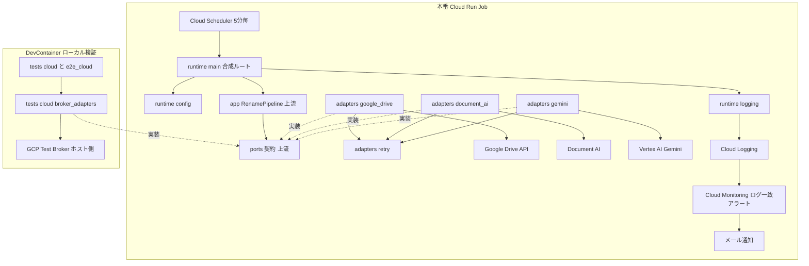
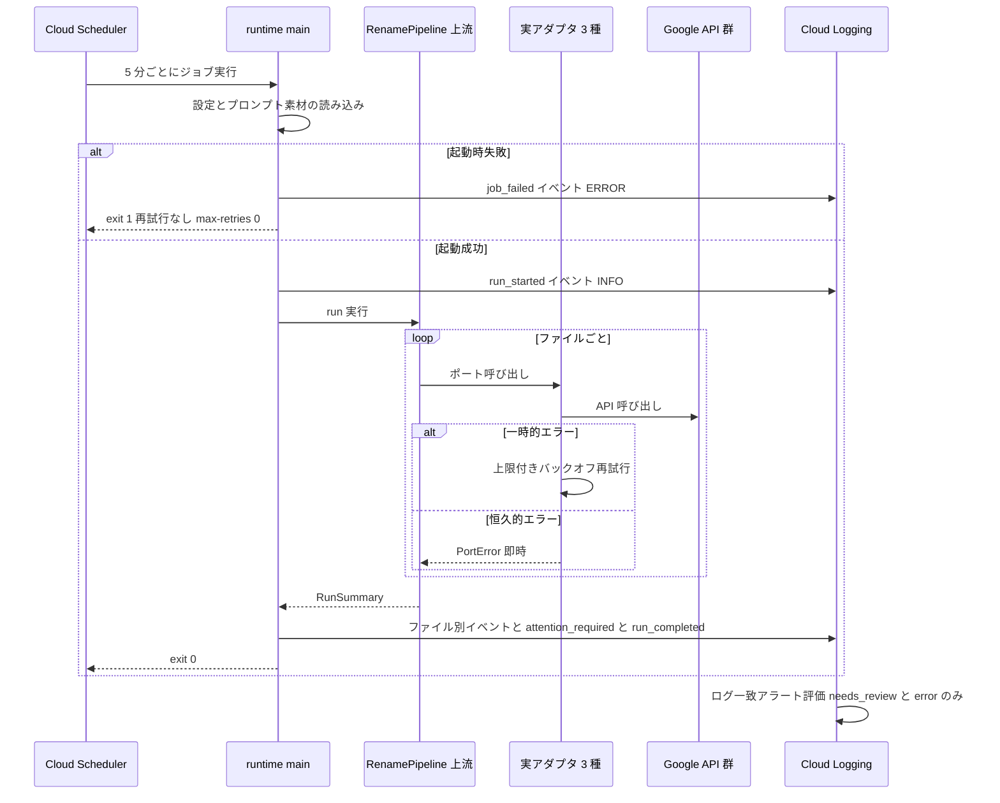

# Design Document: cloud-runtime-deploy

## Overview

**Purpose**: 本機能は、スキャン PDF 自動リネームシステム v1 を本番稼働させる。extraction-pipeline が定義したポート契約に対する実アダプタ（Google Drive API / Document AI / Gemini）を実装し、パイプラインを Cloud Run Job としてパッケージングし、Cloud Scheduler で 5 分ごとに起動し、要確認・エラーを構造化ログ → Cloud Monitoring ログベースアラート → メールで運用者に通知する。

**Users**: 運用者（本人）が Drive 上の自動リネーム結果とメール通知を受け取る。開発者（本人 + Claude Code）は Broker 経由の `cloud` / `e2e_cloud` テストでデプロイ前検証を行う。本スペックは v1 の最終スペックであり、下流の消費者はいない。

**Impact**: `src/scanner_rename/` に `adapters/`（実アダプタ）と `runtime/`（合成ルート・設定・ログ）を追加する。`deploy/` を新設し Dockerfile とデプロイスクリプト・手順書を置く。`pyproject.toml` にランタイム依存（Google クライアント 4 種）を追加し、`e2e_cloud` マーカーの説明を実態に更新する。上流の `domain` / `ports` / `extraction` / `app` は変更しない。

### Goals

- 実アダプタ 3 種がポート契約（事後条件・`PortError` 派生の失敗表現）を満たし、単体テストで契約適合を固定する
- インフラレベルのリトライ戦略（一時的/恒久的の分類、上限付きバックオフ、ジョブ再試行の抑制、実行の重なり防止）を一貫実装する
- Broker 経由の `cloud` テストと、ジョブ全体を 1 回通す `e2e_cloud` ローカル E2E をグリーンにしてからデプロイできる状態にする
- 構造化ログとログベースアラートで「needs_review と error のみ通知、成功時は通知しない」を構成的に成立させる

### Non-Goals

- ポート契約・抽出スキーマ・アプリレベル状態遷移の変更（extraction-pipeline 所有）
- Broker API の形状定義・拡張実装（gcp-test-broker 所有。必要な拡張は変更要求として記録）
- Drive プッシュ通知、Firestore 等ステートストア、Gmail API 直接送信、複数文書 PDF 分割
- Terraform/IaC の本格整備（デプロイは gcloud CLI スクリプト + 手順書。IaC 化は将来 PBI）
- DevContainer からの実 Google API 自動 E2E（Broker の実 API 仲介拡張後の将来 PBI）

## Boundary Commitments

### This Spec Owns

- 実アダプタ 3 種の実装と、SDK 例外 → `PortError` 派生への変換規則
- インフラレベルのリトライ戦略（分類・バックオフ・上限）と、Cloud Run Job / Cloud Scheduler の実行パラメータ（max-retries・タイムアウト・間隔）
- ジョブのエントリポイント・実行時設定（環境変数契約）・終了コードポリシー
- 構造化ログのイベントスキーマ（`event` / `status` / `severity` フィールド）と、それを消費するアラートポリシー・通知チャネルの構成
- コンテナパッケージング（Dockerfile）とデプロイスクリプト・手順書（runbook）
- `tests/cloud/` のテスト用 Broker アダプタと本スペック分の `cloud` テスト、`tests/e2e_cloud/` のローカル E2E

### Out of Boundary

- ポート契約・DTO・例外階層・`DocumentExtraction` スキーマ・`RunSummary` / `FileOutcome`（extraction-pipeline 所有。本スペックは実装・消費のみ）
- 命名規則・状態プレフィックス文字列・ファイル名分類（core-naming-engine 所有）
- Broker のエンドポイント・JSON スキーマ・エラー形式（gcp-test-broker 所有。本スペックのテストは消費者）
- アプリレベルのエラーハンドリング（要確認/エラー遷移・障害分離。extraction-pipeline の `RenamePipeline` 所有）
- gitleaks 等のシークレットスキャン基盤（secret-scanning 所有）

### Allowed Dependencies

- 上流コード: `scanner_rename.domain` / `scanner_rename.ports` / `scanner_rename.extraction` / `scanner_rename.app`（公開 API のみ）
- ランタイム依存の追加: `google-api-python-client`、`google-auth`、`google-cloud-documentai`、`google-genai` の 4 つのみ。これ以外のランタイム依存追加は本スペックの範囲外
- モジュール依存方向（左から右へのみ import 可）: `ports` / `extraction`（上流）→ `adapters/retry` → `adapters/{google_drive, document_ai, gemini}` → `runtime/config` → `runtime/logging` → `runtime/main`。`adapters` から `runtime` への import は禁止。`app` を import するのは `runtime/main` と テストのみ
- `tests/cloud/` / `tests/e2e_cloud/`: 標準ライブラリ `urllib.request` + `scanner_rename` 公開契約のみ。Broker 以外の外部接続禁止
- 本番ランタイムは ADC（Cloud Run のサービスアイデンティティ）のみで認証する。サービスアカウントキー・API キーへの依存を持たない

### Revalidation Triggers

- ポート契約・`DocumentExtraction`・`RunSummary` の形状変更（上流の Revalidation Triggers と対。実アダプタ・response schema・ログイベントの追随が必要）
- Broker API の形状変更（`tests/cloud/` のテスト用アダプタに影響）
- 構造化ログのイベントスキーマ（`event` / `status` フィールド名・値）の変更 — アラートポリシーのフィルタと運用手順の更新が必須
- 環境変数契約（名前・必須/任意・既定値）の変更 — デプロイスクリプト・runbook の更新が必須
- 確定版プロンプト素材のファイル名・配置変更（Dockerfile の同梱パスに影響）
- Cloud Scheduler の間隔変更 — タスクタイムアウト（重なり防止）の再計算が必要

## Architecture

### Architecture Pattern & Boundary Map

ヘキサゴナル（上流設計の継承）。実アダプタはポート Protocol の実装、`runtime` が合成ルートとして全体を組み立てる。本番経路とローカルテスト経路は合成時に完全に分離される。



**Architecture Integration**:

- Selected pattern: 上流のヘキサゴナルをそのまま継承。実アダプタは Pyright による Protocol 適合の静的検証を受ける（継承なし）
- Domain boundaries: 本番経路（実アダプタ）とテスト経路（Broker アダプタ）はどちらも同一のポート契約を実装するが、コード上は `src/` と `tests/` に分離され、互いに import しない
- Steering compliance: ADR 0001（Cloud Run Job）、0002（ポーリング）、0003（ファイル名状態のみ）、0004（Broker 経由テスト）、0005（プロンプト素材同梱）に準拠
- リトライはアダプタ層に閉じる: パイプライン（上流）はリトライを行わない設計のため、インフラレベルの再試行は各アダプタのメソッド内で完結し、失敗の最終形はポート契約どおり `PortError` 派生で表現する

### Technology Stack

| Layer          | Choice / Version                              | Role in Feature                            | Notes                                                        |
| -------------- | --------------------------------------------- | ------------------------------------------ | ------------------------------------------------------------ |
| Drive アクセス | google-api-python-client + google-auth（ADC） | `DrivePort` 実装（一覧・取得・リネーム）   | Drive API v3。フォルダ ID は環境変数注入                     |
| OCR            | google-cloud-documentai                       | `OcrPort` 実装（PDF → 全文テキスト）       | `process_document` + raw_document                            |
| LLM 抽出       | google-genai（Vertex AI バックエンド）        | `ExtractionPort` 実装（構造化出力）        | `vertexai=True`、ADC 認証、API キー不使用                    |
| Runtime        | Python >= 3.13 + uv、Cloud Run Job            | 単発バッチ実行                             | `--max-retries=0`、タスクタイムアウト 240 秒                 |
| Packaging      | Dockerfile（python:3.13-slim ベース、uv）     | イメージ化・プロンプト素材同梱             | 非 root 実行。認証情報を含まない                             |
| Scheduling     | Cloud Scheduler                               | 5 分ごとのジョブ起動                       | `*/5 * * * *`、専用起動 SA（run.invoker）                    |
| Observability  | 構造化 JSON ログ（stdout）+ ログ一致アラート  | 要確認/エラーのメール通知                  | ロギングクライアント不使用。`severity` フィールドで重大度    |
| Testing        | pytest `unit` / `cloud` / `e2e_cloud`         | 契約適合・Broker 統合・ローカル E2E        | 既定 `addopts` で cloud 系は除外済み。SDK 境界はスタブで単体 |
| Deploy         | gcloud CLI スクリプト + runbook               | 最小構成のセットアップ・デプロイ・監視構成 | IaC 化は将来 PBI                                             |

## File Structure Plan

### Directory Structure

```text
src/scanner_rename/
├── adapters/
│   ├── retry.py               # RetryPolicy と execute_with_retry（共通リトライヘルパ）
│   ├── google_drive.py        # GoogleDriveAdapter（DrivePort 実装 + Drive 固有のエラー分類）
│   ├── document_ai.py         # DocumentAiOcrAdapter（OcrPort 実装）
│   └── gemini.py              # GeminiExtractionAdapter（ExtractionPort 実装 + response schema + 応答パース）
└── runtime/
    ├── __init__.py            # ランタイム層公開 API の再エクスポート
    ├── config.py              # RuntimeConfig（環境変数契約・起動時検証・ConfigError）
    ├── logging.py             # 構造化 JSON ログ（フォーマッタ + イベント出力関数）
    └── main.py                # エントリポイント（合成ルート・実行・終了コード）

deploy/
├── Dockerfile                 # ジョブのコンテナイメージ定義（プロンプト素材同梱）
├── setup_gcp.sh               # 初回セットアップ（API 有効化・SA 作成・権限付与・DocAI プロセッサ）
├── deploy_job.sh              # イメージビルドと Cloud Run Job のデプロイ（環境変数・max-retries・timeout）
├── setup_monitoring.sh        # メール通知チャネルとログ一致アラートポリシー 2 件の作成
├── setup_scheduler.sh         # Cloud Scheduler ジョブ（5 分毎）の作成
└── runbook.md                 # デプロイ・スモーク確認・手動リトライ運用・制約の手順書

tests/
├── unit/
│   ├── test_retry.py              # リトライヘルパ（分類・バックオフ・上限）
│   ├── test_google_drive_adapter.py  # Drive アダプタ（スタブ SDK で契約適合・エラー変換）
│   ├── test_document_ai_adapter.py   # OCR アダプタ（同上・空文書）
│   ├── test_gemini_adapter.py        # 抽出アダプタ（schema 構築・パース・不適合再要求）
│   ├── test_runtime_config.py        # 環境変数契約（必須欠落・既定値）
│   ├── test_runtime_logging.py       # ログイベント形状・severity・禁止情報の非包含
│   └── test_runtime_main.py          # 合成ルート（フェイク注入で終了コード・イベント発火）
├── cloud/
│   ├── broker_adapters.py         # テスト用 Broker アダプタ（OcrPort / ExtractionPort 実装）
│   └── test_broker_adapters.py    # cloud マーカー: アダプタ経由の契約適合・エラー変換
└── e2e_cloud/
    ├── __init__.py
    ├── conftest.py                # Broker プリフライト（tests/cloud と同方式）+ E2E 組み立て
    └── test_job_e2e.py            # e2e_cloud マーカー: ジョブ全体 1 回通し・冪等性・ログ検証
```

### Modified Files

- `pyproject.toml` — `[project].dependencies` に Google クライアント 4 種を追加。`e2e_cloud` マーカーの説明を「end-to-end job runs via test broker」に更新
- `tests/README.md` — `cloud` / `e2e_cloud` の実行前提（Broker 起動・環境変数）に本スペック分を追記
- `.kiro/specs/gcp-test-broker/` への変更要求はコード変更ではなくメモとして記録（8.5。実 API 仲介エンドポイントの将来要求）

> `tests/cloud/conftest.py`（Broker URL 解決・プリフライト）は gcp-test-broker 所有の既存資産を再利用し、変更しない。

## System Flows

本番実行 1 回のフロー（アダプタ内リトライと終了コードの決定点のみ。ファイル単位の分岐は上流設計を参照）:



フローレベルの決定事項:

- リトライはアダプタのメソッド内で完結し、パイプラインには成功か `PortError` かのみが見える（上流の「リトライは行わない」設計と整合）
- `RunSummary` が得られた実行は per-file エラーがあっても exit 0。ジョブの失敗ステータスは起動時失敗専用（research.md の決定）
- 通知はログ一致アラートのみ。成功・スキップのイベントはどのアラートフィルタにも一致しない（6.5 の構成的保証）
- 実行の重なりはタスクタイムアウト 240 秒（< 5 分間隔）で構造的に防止する（4.5）

## Requirements Traceability

| Requirement | Summary                     | Components                                      | Interfaces                                         |
| ----------- | --------------------------- | ----------------------------------------------- | -------------------------------------------------- |
| 1.1–1.4     | Drive 実操作と失敗変換      | adapters/google_drive, adapters/retry           | `GoogleDriveAdapter`（`DrivePort` 実装）           |
| 1.5         | SA 認証・キー不使用         | adapters/google_drive, deploy/setup_gcp.sh      | ADC（`google.auth.default`）                       |
| 2.1–2.3     | OCR 実行と失敗変換          | adapters/document_ai                            | `DocumentAiOcrAdapter`（`OcrPort` 実装）           |
| 3.1–3.4     | 構造化抽出と schema 適合    | adapters/gemini, extraction/prompts（上流）     | `GeminiExtractionAdapter`（`ExtractionPort` 実装） |
| 4.1–4.3     | 一時的/恒久的の分類と再試行 | adapters/retry, 実アダプタ 3 種                 | `RetryPolicy`, `execute_with_retry`                |
| 4.4         | 冪等性の保証                | adapters/google_drive, tests/e2e_cloud          | file_id 指定リネーム + ファイル名分類（上流）      |
| 4.5         | 実行の重なり防止            | deploy/deploy_job.sh                            | タスクタイムアウト 240 秒 + 間隔 5 分              |
| 4.6         | 起動時失敗の扱い            | runtime/main, deploy/deploy_job.sh              | exit 1 + `--max-retries=0`                         |
| 5.1–5.5     | パッケージングと実行契約    | deploy/Dockerfile, runtime/config, runtime/main | `RuntimeConfig.from_env`, エントリポイント         |
| 5.6         | 認証情報の非包含            | deploy/ 全体, secret-scanning（隣接）           | イメージ・スクリプトに秘密なし                     |
| 6.1–6.3     | 構造化ログイベント          | runtime/logging, runtime/main                   | `JsonLogWriter` とイベント関数群                   |
| 6.4–6.5     | メール通知と成功時非通知    | deploy/setup_monitoring.sh                      | 通知チャネル + ログ一致アラートポリシー 2 件       |
| 6.6         | ログの機微情報非包含        | runtime/logging                                 | イベントスキーマ（許可フィールドのみ）             |
| 7.1         | 5 分ごとの定期実行          | deploy/setup_scheduler.sh                       | Cloud Scheduler `*/5 * * * *`                      |
| 7.2         | 最小権限 SA                 | deploy/setup_gcp.sh                             | 専用 SA + ロール付与                               |
| 7.3–7.5     | デプロイ再現性・手順書      | deploy/ スクリプト群, deploy/runbook.md         | セットアップ → デプロイ → 確認の手順               |
| 8.1–8.4     | Broker 経由 cloud テスト    | tests/cloud/broker_adapters.py, tests/cloud     | `BrokerOcrAdapter`, `BrokerExtractionAdapter`      |
| 8.5         | Broker 拡張の変更要求       | deploy/runbook.md（制約節）+ 変更要求メモ       | —                                                  |
| 9.1–9.5     | Broker 経由ローカル E2E     | tests/e2e_cloud, runtime/logging                | `RenamePipeline` + FakeDrive + Broker アダプタ     |

## Components and Interfaces

| Component             | Domain/Layer   | Intent                                    | Req Coverage                | Key Dependencies                            | Contracts |
| --------------------- | -------------- | ----------------------------------------- | --------------------------- | ------------------------------------------- | --------- |
| adapters/retry        | インフラ基盤   | 分類注入型の上限付きバックオフ再試行      | 4.1–4.3                     | なし（標準ライブラリ）                      | Service   |
| adapters/google_drive | 実アダプタ     | `DrivePort` の Drive API v3 実装          | 1.1–1.5, 4.1–4.4            | retry (P0), google-api-python-client (P0)   | Service   |
| adapters/document_ai  | 実アダプタ     | `OcrPort` の Document AI 実装             | 2.1–2.3, 4.1–4.3            | retry (P0), google-cloud-documentai (P0)    | Service   |
| adapters/gemini       | 実アダプタ     | `ExtractionPort` の Gemini 構造化出力実装 | 3.1–3.4, 4.1–4.3            | retry (P0), google-genai (P0), prompts (P0) | Service   |
| runtime/config        | ランタイム     | 環境変数契約と起動時検証                  | 5.2                         | なし                                        | State     |
| runtime/logging       | ランタイム     | 構造化 JSON ログのイベント出力            | 6.1–6.3, 6.6                | RunSummary 型（上流, P0）                   | Service   |
| runtime/main          | ランタイム     | 合成ルート・実行・終了コード              | 4.6, 5.1, 5.4, 5.5          | config, logging, adapters, app（すべて P0） | Batch     |
| deploy/Dockerfile     | パッケージング | イメージ定義（プロンプト同梱・非 root）   | 5.1, 5.3, 5.6               | uv, python 3.13-slim (P0)                   | —         |
| deploy スクリプト群   | 運用構成       | SA・ジョブ・監視・スケジューラの再現構成  | 4.5, 6.4, 6.5, 7.1–7.3, 7.5 | gcloud CLI (P0)                             | —         |
| deploy/runbook.md     | 運用文書       | デプロイ・スモーク・手動リトライの手順    | 7.3, 7.4, 7.5, 8.5          | —                                           | —         |
| tests/cloud（拡張）   | テスト基盤     | Broker アダプタと契約適合テスト           | 8.1–8.5                     | Broker v0 API (P0), ports/extraction (P0)   | —         |
| tests/e2e_cloud       | テスト基盤     | ジョブ全体のローカル E2E                  | 9.1–9.5                     | broker_adapters (P0), FakeDrive（上流, P0） | —         |

### インフラ基盤レイヤ

#### adapters/retry

| Field        | Detail                                                             |
| ------------ | ------------------------------------------------------------------ |
| Intent       | 例外分類を注入できる、上限回数付き指数バックオフの共通リトライ実行 |
| Requirements | 4.1, 4.2, 4.3                                                      |

**Responsibilities & Constraints**

- 一時的と分類された例外のみ再試行する。恒久的エラーは初回で即時再送出（4.3）
- バックオフ: `base_delay * 2^attempt` にフルジッタを掛け、`max_delay` で頭打ち。既定は最大 4 試行・base 1 秒・cap 10 秒
- 上限到達時は最後の例外をそのまま送出する（`PortError` への変換は呼び出し側アダプタの責務、4.2）
- `sleep` 関数を注入可能にし、単体テストで実時間待機なしに検証できる決定論的構造とする

##### Service Interface

```python
@dataclass(frozen=True)
class RetryPolicy:
    max_attempts: int = 4        # 初回 + 再試行 3 回
    base_delay_seconds: float = 1.0
    max_delay_seconds: float = 10.0

def execute_with_retry[T](
    operation: Callable[[], T],
    is_transient: Callable[[BaseException], bool],
    policy: RetryPolicy,
    sleep: Callable[[float], None] = time.sleep,
) -> T: ...
```

- Preconditions: `max_attempts >= 1`（違反は `ValueError`）
- Postconditions: 成功時は `operation` の戻り値をそのまま返す。失敗時は最後に観測した例外を送出する
- Invariants: `is_transient` が偽を返した例外で再試行しない。総試行回数は `max_attempts` を超えない

### 実アダプタレイヤ

3 アダプタ共通の設計規約:

- Pyright がポート Protocol への適合を静的検証する（継承なし。フェイクアダプタと同方式）
- SDK 例外は必ず対応する `PortError` 派生（`DriveError` / `OcrError` / `ExtractionError`）へ変換して送出する。例外メッセージは診断可能な要約とし、認証情報・トークン・OCR 全文・PDF 内容を含めない
- 一時的エラーの共通分類: HTTP 429 / 500 / 502 / 503 / 504、接続エラー・タイムアウト（`google.api_core` の `ResourceExhausted` / `ServiceUnavailable` / `DeadlineExceeded` / `InternalServerError` を含む）。恒久的: 400 / 401 / 403（権限系）/ 404 等
- SDK クライアントはコンストラクタ注入とし、単体テストでスタブに差し替える（ネットワーク不要）

#### adapters/google_drive

| Field        | Detail                                                      |
| ------------ | ----------------------------------------------------------- |
| Intent       | 監視フォルダにスコープした `DrivePort` の Drive API v3 実装 |
| Requirements | 1.1, 1.2, 1.3, 1.4, 1.5, 4.1, 4.2, 4.3, 4.4                 |

**Responsibilities & Constraints**

- 構築時にフォルダ ID・Drive サービスクライアント・`RetryPolicy` を受け取る。フォルダ解決ロジックを持たない（ID 直接指定）
- `list_files`: クエリ `'<folder_id>' in parents and trashed = false and mimeType != 'application/vnd.google-apps.folder'`、`fields="nextPageToken, files(id, name)"`、ページネーション全消化。直下のファイルのみ返す契約の事後条件を満たす（1.1）
- `download`: `files().get_media(fileId=...)` で PDF バイト列を取得（1.2）
- `rename`: `files().update(fileId=..., body={"name": new_name}, fields="id")`。名前以外のフィールドを送らない（1.3）。file_id + 確定名への更新であるため再送は同一結果に収束し、二重リネーム・多重サフィックスを生まない（4.4）
- Drive 固有の一時的エラー分類: 共通分類に加え、HTTP 403 のうち reason が `userRateLimitExceeded` / `rateLimitExceeded` のものを一時的として扱う。その他の 403（権限不足）は恒久的（4.1, 4.3）
- 認証は ADC（`google.auth.default()`）。Cloud Run 上ではサービスアイデンティティが自動供給され、キーファイルを扱わない（1.5）

##### Service Interface

```python
class GoogleDriveAdapter:  # DrivePort 適合
    def __init__(
        self,
        drive_service: Any,          # googleapiclient discovery Resource（スタブ差し替え可能）
        folder_id: str,
        retry_policy: RetryPolicy,
        sleep: Callable[[float], None] = time.sleep,
    ) -> None: ...
    def list_files(self) -> list[DriveFile]: ...
    def download(self, file_id: str) -> bytes: ...
    def rename(self, file_id: str, new_name: str) -> None: ...
```

- Postconditions: ポート契約どおり（`rename` 成功後の `list_files` は新名を返す）
- Invariants: 失敗はすべて `DriveError`。監視フォルダ外への操作経路を持たない

**Implementation Notes**

- Integration: クライアント構築（`build("drive", "v3", ...)`）は `runtime/main` の合成ルートで行う
- Validation: スタブ SDK で 一覧のページネーション・ゴミ箱/サブフォルダ除外クエリ・403 reason 分岐・リネームの送信ボディを単体テストで固定
- Risks: フォルダ未共有だと一覧が常に 0 件で異常に見えない → runbook のスモーク手順（テストファイル投入 → リネーム確認）で検出

#### adapters/document_ai

| Field        | Detail                        |
| ------------ | ----------------------------- |
| Intent       | `OcrPort` の Document AI 実装 |
| Requirements | 2.1, 2.2, 2.3, 4.1, 4.2, 4.3  |

**Responsibilities & Constraints**

- 構築時に Document AI クライアント・プロセッサリソース名（`projects/{p}/locations/{loc}/processors/{id}`）・`RetryPolicy` を受け取る
- `recognize`: `process_document(raw_document=(pdf_content, "application/pdf"))` を呼び、`document.text` を `OcrResult` として返す。テキスト未検出は `text=""` の正常応答（2.2）
- 失敗（呼び出し障害・恒久エラー）は `OcrError` に変換（2.3）。一時的エラーは共通分類で再試行（4.1–4.3）

##### Service Interface

```python
class DocumentAiOcrAdapter:  # OcrPort 適合
    def __init__(
        self,
        docai_client: Any,           # documentai DocumentProcessorServiceClient 互換
        processor_name: str,
        retry_policy: RetryPolicy,
        sleep: Callable[[float], None] = time.sleep,
    ) -> None: ...
    def recognize(self, pdf_content: bytes) -> OcrResult: ...
```

**Implementation Notes**

- Validation: スタブクライアントで 正常応答 → `OcrResult`、空テキスト、`ResourceExhausted`（再試行）、`PermissionDenied`（即時 `OcrError`）を固定
- Risks: 大きな PDF の同期処理上限（オンラインプロセスのページ上限）→ 上限超過は恒久的エラーとして `OcrError`（当該ファイルのみ `rename_error_` 遷移）。runbook の制約節に記載

#### adapters/gemini

| Field        | Detail                                    |
| ------------ | ----------------------------------------- |
| Intent       | `ExtractionPort` の Gemini 構造化出力実装 |
| Requirements | 3.1, 3.2, 3.3, 3.4, 4.1, 4.2, 4.3         |

**Responsibilities & Constraints**

- 構築時に genai クライアント・モデル名・`PromptMaterials`（上流ローダで読み込み済み）・`RetryPolicy` を受け取る（3.1）
- 要求構成: system instruction = 抽出ポリシー + 命名ポリシーの連結。user content = OCR テキストのみ。これ以外の情報を要求に載せない構造とする（3.4）
- 構造化出力: `response_mime_type="application/json"` + `response_schema`。schema は `DocumentExtraction` のフィールド構成（nullable サブオブジェクト、期間種別 enum、confidence 数値）を鏡写しにした辞書定数としてモジュール内に一元定義する（3.2。正本は上流 `extraction/schema.py`、乖離時は追随）
- 応答パース: JSON → 上流 frozen dataclass 群の構築。`__post_init__` の不変条件検証を最終ゲートとし、JSON 不正・構築時 `ValueError` は「スキーマ不適合」として同一要求を 1 回だけ再要求（計 2 試行）。それでも不適合なら `ExtractionError`（3.3）
- 通信レベルの一時的エラー（429/5xx/タイムアウト）は共通リトライで扱い、スキーマ不適合の再要求とは独立に数える（4.1–4.3）

##### Service Interface

```python
GEMINI_RESPONSE_SCHEMA: dict[str, Any]   # DocumentExtraction の鏡写し（モジュール定数）

class GeminiExtractionAdapter:  # ExtractionPort 適合
    def __init__(
        self,
        genai_client: Any,           # google-genai Client 互換（vertexai=True で構築）
        model: str,
        prompts: PromptMaterials,
        retry_policy: RetryPolicy,
        schema_retry_limit: int = 1,  # スキーマ不適合時の再要求回数
        sleep: Callable[[float], None] = time.sleep,
    ) -> None: ...
    def extract(self, ocr_result: OcrResult) -> DocumentExtraction: ...
```

- Postconditions: 戻り値は上流スキーマの不変条件を満たす `DocumentExtraction`
- Invariants: 失敗はすべて `ExtractionError`。要求ペイロードに OCR テキストとプロンプト素材以外を含めない

**Implementation Notes**

- Validation: スタブクライアントで 正常 JSON → `DocumentExtraction` 構築、期間 3 種のパース、破損 JSON → 再要求 1 回 → `ExtractionError`、要求ペイロードの内容検証（禁止情報なし）を固定
- Risks: モデル名の失効 → 環境変数 `GEMINI_MODEL` で差し替え可能（research.md）

### ランタイムレイヤ

#### runtime/config

| Field        | Detail                               |
| ------------ | ------------------------------------ |
| Intent       | 環境変数契約の解決と起動時 fail fast |
| Requirements | 5.2                                  |

**Responsibilities & Constraints**

- 環境変数契約（本スペックの所有物。変更は Revalidation Trigger）:

| 変数                   | 必須 | 既定値                 | 用途                                   |
| ---------------------- | ---- | ---------------------- | -------------------------------------- |
| `GOOGLE_CLOUD_PROJECT` | Yes  | —                      | プロジェクト ID（DocAI / Vertex 共用） |
| `DRIVE_FOLDER_ID`      | Yes  | —                      | 監視フォルダの Drive ID                |
| `DOCAI_LOCATION`       | Yes  | —                      | Document AI ロケーション（例: `us`）   |
| `DOCAI_PROCESSOR_ID`   | Yes  | —                      | Document AI OCR プロセッサ ID          |
| `GEMINI_MODEL`         | No   | `gemini-2.5-flash`     | 抽出に使うモデル名                     |
| `GEMINI_LOCATION`      | No   | `global`               | Vertex AI ロケーション                 |
| `CONFIDENCE_THRESHOLD` | No   | `0.7`                  | `PipelineConfig` へ渡す信頼度しきい値  |
| `PROMPTS_DIR`          | No   | `/app/app_llm_prompts` | 同梱プロンプト素材のディレクトリ       |

- 必須欠落・数値パース不能・しきい値範囲外は `ConfigError` で即時失敗（5.2。曖昧なフォールバックをしない）

##### Service Interface

```python
class ConfigError(Exception): ...

@dataclass(frozen=True)
class RuntimeConfig:
    project_id: str
    drive_folder_id: str
    docai_location: str
    docai_processor_id: str
    gemini_model: str
    gemini_location: str
    confidence_threshold: float
    prompts_dir: Path

def load_runtime_config(env: Mapping[str, str]) -> RuntimeConfig: ...
```

- Postconditions: 戻り値の全フィールドは検証済み（threshold は 0.0–1.0）
- Invariants: 環境変数の値そのものをログ・例外メッセージへ全文ダンプしない（欠落した変数名のみ示す）

#### runtime/logging

| Field        | Detail                                               |
| ------------ | ---------------------------------------------------- |
| Intent       | Cloud Logging が解釈できる構造化 JSON イベントの出力 |
| Requirements | 6.1, 6.2, 6.3, 6.6                                   |

**Responsibilities & Constraints**

- stdout へ 1 イベント 1 行の JSON を出力する。各イベントは `severity`（`INFO` / `WARNING` / `ERROR`）と `event` を必ず持つ。Cloud Run が stdout を Cloud Logging の `jsonPayload` として取り込む（追加ライブラリ不要）
- イベントスキーマ（アラートフィルタとの契約。変更は Revalidation Trigger）:

| event                               | severity        | 追加フィールド                                           | 発火条件                                     |
| ----------------------------------- | --------------- | -------------------------------------------------------- | -------------------------------------------- |
| `scanner_rename_run_started`        | INFO            | —                                                        | 起動成功直後（6.1）                          |
| `scanner_rename_file_processed`     | INFO            | `file_name`, `outcome`（renamed/skipped）, `new_name`    | 成功・スキップのファイル（6.1）              |
| `scanner_rename_attention_required` | WARNING / ERROR | `status`（needs_review/error）, `file_name`, `reason`    | 要確認 = WARNING、エラー = ERROR（6.2, 6.3） |
| `scanner_rename_run_completed`      | INFO            | `renamed`, `needs_review`, `errors`, `skipped`（各件数） | `RunSummary` 取得後（6.1）                   |
| `scanner_rename_job_failed`         | ERROR           | `reason`（例外型名 + 要約）                              | 起動時失敗（6.3）                            |

- 許可フィールドのみを出力する（イベント関数のシグネチャで構造的に制限）。`FileOutcome.detail` は上流で機微情報を含まないことが保証済みの要約であり、そのまま `reason` に使える。認証情報・トークン・環境変数ダンプ・OCR 全文・PDF 内容を表現するフィールドは存在しない（6.6）
- `attention_required` のフィールド構成は `docs/security-notes.md` の合意例（`event` / `status` / `file_name` / `reason` / `severity`）に一致させる

##### Service Interface

```python
class JsonLogWriter:
    def __init__(self, stream: TextIO = sys.stdout) -> None: ...
    def run_started(self) -> None: ...
    def file_processed(self, outcome: FileOutcome) -> None: ...
    def attention_required(self, outcome: FileOutcome) -> None: ...
    def run_completed(self, summary: RunSummary) -> None: ...
    def job_failed(self, reason: str) -> None: ...
```

- Invariants: 出力は常に 1 行の有効な JSON。`stream` 注入によりテストで全出力を捕捉できる

#### runtime/main

| Field        | Detail                                                  |
| ------------ | ------------------------------------------------------- |
| Intent       | 合成ルート: 設定 → アダプタ構築 → パイプライン 1 回実行 |
| Requirements | 4.6, 5.1, 5.2, 5.4, 5.5                                 |

**Responsibilities & Constraints**

- 実行順: `load_runtime_config` → `load_prompt_materials`（上流）→ SDK クライアント + 実アダプタ 3 種の構築 → `RenamePipeline.run()` → `RunSummary` の全件をログ出力（`file_processed` / `attention_required`）→ `run_completed` → exit 0
- 起動時失敗（`ConfigError` / `PromptLoadError` / 一覧取得の `DriveError` / クライアント構築失敗）は `job_failed` イベントを出して exit 1（4.6, 5.5）。ジョブレベルの自動再試行は行わない（デプロイ側 `--max-retries=0` とセット）
- per-file の要確認・エラーは exit code に影響させない（5.4。通知はログイベント経由）
- テスト容易性のため、合成済み依存を受け取る `run_job(...) -> int` と、環境から組み立てる `main()` を分離する

##### Batch / Job Contract

- Trigger: Cloud Scheduler（5 分毎）または手動 `gcloud run jobs execute`。コンテナ起動 = 1 実行
- Input / validation: 環境変数（`RuntimeConfig` 契約）。事前条件は起動時に fail fast
- Output / destination: Drive 上のリネーム（上流パイプラインの副作用）+ 構造化ログ（stdout → Cloud Logging）
- Idempotency & recovery: 状態は Drive ファイル名のみ（ADR 0003）。遷移済みファイルは再実行で再処理されず、実行途中の失敗は次回定期実行が未処理分のみ処理する。exit 1 でも再試行せず 5 分後の次回実行に委ねる

**Implementation Notes**

- Integration: Dockerfile の `ENTRYPOINT` は `python -m scanner_rename.runtime.main`
- Validation: フェイクポート + フェイク環境で exit 0 / exit 1、イベント発火順、`attention_required` の WARNING/ERROR 振り分けを単体テストで固定
- Risks: 広い起動時例外捕捉によるバグ潜伏 → `job_failed.reason` に例外型名を必ず含める

### パッケージング・運用構成

#### deploy/Dockerfile

| Field        | Detail                       |
| ------------ | ---------------------------- |
| Intent       | ジョブのコンテナイメージ定義 |
| Requirements | 5.1, 5.3, 5.6                |

**Responsibilities & Constraints**

- `python:3.13-slim` ベースの 2 ステージ構成。ビルドステージで uv により依存を解決し、実行ステージへ仮想環境と `src/scanner_rename` を配置する
- `app_llm_prompts/`（確定版 `extraction_policy.md` / `naming_policy.md`）を `/app/app_llm_prompts` に同梱する（5.3。`PROMPTS_DIR` 既定値と一致）
- 非 root ユーザーで実行。認証情報・`.env`・キー類を一切 COPY しない（5.6。ビルドコンテキストは `src` / `app_llm_prompts` / `pyproject.toml` / `uv.lock` に限定）
- `ENTRYPOINT ["python", "-m", "scanner_rename.runtime.main"]`（5.1）

**Implementation Notes**

- Validation: ローカルで `docker build` が成功し、`docker run`（必須環境変数なし）が `job_failed` イベント + exit 1 で終了することを確認（起動時 fail fast の実証）

#### deploy スクリプト群（setup_gcp.sh / deploy_job.sh / setup_monitoring.sh / setup_scheduler.sh）

| Field        | Detail                                            |
| ------------ | ------------------------------------------------- |
| Intent       | gcloud CLI による再現可能な最小構成のセットアップ |
| Requirements | 4.5, 6.4, 6.5, 7.1, 7.2, 7.3, 7.5                 |

**Responsibilities & Constraints**

- `setup_gcp.sh`（初回のみ）: 必要 API の有効化（run / documentai / aiplatform / drive / cloudscheduler / monitoring）、実行用 SA `scanner-rename-job@...` と起動用 SA `scanner-rename-invoker@...` の作成、ロール付与（実行 SA: `roles/documentai.apiUser`, `roles/aiplatform.user`, `roles/logging.logWriter`。起動 SA: 対象ジョブへの `roles/run.invoker`）、Document AI OCR プロセッサの作成（7.2）。Drive 権限は IAM でなくフォルダ共有で付与するため、スクリプトは実行 SA のメールアドレスを表示し runbook の共有手順へ誘導する（7.5）
- `deploy_job.sh`: ソースからのイメージビルド（`gcloud builds submit` → Artifact Registry）と `gcloud run jobs deploy`。環境変数一式・`--max-retries=0`（4.6 とセット）・`--task-timeout=240s`（4.5）・実行 SA を設定する
- `setup_monitoring.sh`: メール通知チャネル（fumiaki.k@gmail.com）の作成と、ログ一致条件のアラートポリシー 2 件の作成（6.4）:
  - needs_review: `resource.type="cloud_run_job" AND jsonPayload.event="scanner_rename_attention_required" AND jsonPayload.status="needs_review"`
  - error: `resource.type="cloud_run_job" AND severity>=ERROR AND (jsonPayload.event="scanner_rename_attention_required" OR jsonPayload.event="scanner_rename_job_failed")`
  - 成功・スキップのイベントはいずれのフィルタにも一致しない（6.5 の構成的保証）
- `setup_scheduler.sh`: Cloud Scheduler HTTP ジョブ（`*/5 * * * *`）を Cloud Run Jobs の `:run` エンドポイントへ、起動 SA の OAuth トークンで作成する（7.1）
- 全スクリプト: プロジェクト ID 等は引数または環境変数で受け取り、シークレット値を一切埋め込まない（5.6）。冪等（再実行時は既存リソースを更新または明示スキップ）

**Implementation Notes**

- Validation: シェル構文チェック（`bash -n`）+ 静的レビュー。実 GCP に対する適用は runbook の手順として運用者が実施（DevContainer から gcloud で Google API を呼ばない）
- Risks: gcloud のフラグ変更 → runbook にバージョン前提を記録

#### deploy/runbook.md

| Field        | Detail                           |
| ------------ | -------------------------------- |
| Intent       | デプロイ・確認・日常運用の手順書 |
| Requirements | 7.3, 7.4, 7.5, 8.5               |

**Responsibilities & Constraints**

- 内容: 前提（gcloud 認証・プロジェクト・Broker はローカル専用で本番に関与しない）→ フォルダ ID 取得と実行 SA へのフォルダ共有（7.5）→ スクリプト実行順 → スモーク確認（テスト PDF 投入 → `gcloud run jobs execute` → Drive 上のリネームとログ・メール通知の確認）→ 手動リトライ運用（`rename_error_` / `_needs_review_` ファイル名をスキャナー生成名に戻す）→ 制約と将来課題（実行間隔とタイムアウトの関係、DevContainer からの実 API 自動 E2E は Broker 拡張後の将来 PBI であることと、必要な Broker 拡張の変更要求内容）（7.4, 8.5）
- `.claude/rules/markdown-style.md` に従い、WHY（構成理由・制約）を中心に書き、コマンド詳細はスクリプトへの参照で済ませる

### テスト基盤レイヤ

#### tests/cloud（broker_adapters.py + test_broker_adapters.py）

| Field        | Detail                                                        |
| ------------ | ------------------------------------------------------------- |
| Intent       | Broker フィクスチャをポート契約の実装として供給するテスト基盤 |
| Requirements | 8.1, 8.2, 8.3, 8.4                                            |

**Responsibilities & Constraints**

- `BrokerOcrAdapter`（`OcrPort` 適合）: PDF バイト列に埋め込まれたケース参照（`case:<case_id>` を UTF-8 で格納したテスト用擬似 PDF 内容）から `case_id` を解決し、`POST /ocr-fixture` の応答を `OcrResult` に変換する。未知ケースの 404 は `OcrError` に変換（8.3）
- `BrokerExtractionAdapter`（`ExtractionPort` 適合）: 構築時に対象ケース一覧の OCR フィクスチャを取得して「OCR テキスト → case_id」対応表を作り、`extract` 時に `POST /extract-fixture` 応答を `DocumentExtraction`（上流 frozen dataclass 群）へ変換する。日付は ISO 文字列 → `date`、期間種別は enum へ写像（gcp-test-broker design の対応表に従う）。Broker エラー・変換不能は `ExtractionError`（8.3）
- HTTP は標準ライブラリ `urllib.request` のみ。接続先は既存 `tests/cloud/conftest.py` の `GCP_TEST_BROKER_URL` 解決とプリフライトを再利用する（8.4）
- `test_broker_adapters.py`（`@pytest.mark.cloud`）: サンプル 4 ケースについて両アダプタの契約適合（事後条件・不変条件通過）、未知 case_id → `PortError` 派生、を検証（8.1, 8.2, 8.3）
- Broker API の不足が判明した場合はテスト内で回避せず、gcp-test-broker への変更要求として記録する（8.5）

#### tests/e2e_cloud（conftest.py + test_job_e2e.py）

| Field        | Detail                                                 |
| ------------ | ------------------------------------------------------ |
| Intent       | Broker 経由でジョブのフロー全体を 1 回通すローカル E2E |
| Requirements | 9.1, 9.2, 9.3, 9.4, 9.5                                |

**Responsibilities & Constraints**

- 組み立て: `FakeDrive`（上流のフェイク。監視フォルダのインメモリ表現）にスキャナー生成名 + ケース参照内容のファイルを 4 件（高信頼 3 + 低信頼 1）投入し、`BrokerOcrAdapter` / `BrokerExtractionAdapter` / `PipelineConfig(0.7)` で `RenamePipeline` を構築して `run()` を 1 回実行する（9.2, 9.5）
- 検証（9.2, 9.3, 9.4）:
  - 合意済み 3 文書例が合意済み最終名（`20211001(R3)_住宅取得資金に係る借入金の年末残高等証明書_三井住友銀行.pdf` 等）へ完全一致でリネームされる
  - 低信頼度ケースが `_needs_review_` 元名へ遷移し、`JsonLogWriter` 経由の出力に `scanner_rename_attention_required`（WARNING, status=needs_review）が含まれる（`RunSummary` を `runtime/logging` に通し stream 捕捉で検証）
  - 2 回目の `run()` で遷移済みファイルが再処理されない（`RunSummary` が全件 skipped、Drive 状態不変）
- すべて `@pytest.mark.e2e_cloud`。既定 `addopts` により通常実行から除外（9.1）。conftest は tests/cloud と同方式の `/health` プリフライトを行う
- 実 Google API のホスト名・実アダプタ（`adapters/google_drive` 等）をこのディレクトリから import しない（9.5 の構造的保証）

## Data Models

本スペックは新しい永続データを導入しない。状態は Drive ファイル名のみ（ADR 0003）。

### Data Contracts & Integration

- ポート契約・抽出スキーマ: 上流の正本に従う（再定義しない）。Gemini response schema と Broker 応答変換は同一スキーマの写像であり、乖離は Revalidation Trigger
- ログイベント契約: `runtime/logging` のイベント表が正本。`setup_monitoring.sh` のアラートフィルタはこの表のフィールド名・値に依存する（同一スペック内契約）
- 環境変数契約: `runtime/config` の表が正本。`deploy_job.sh` が同じ変数名で設定する
- Broker API 契約: gcp-test-broker design.md の API Contract 表が正本。本スペックのテスト用アダプタは消費者

## Error Handling

### Error Strategy

エラーは 3 層で扱う。(1) アダプタ内: 一時的エラーを上限付きで再試行し、最終失敗を `PortError` 派生へ変換する。(2) アプリ層（上流）: `PortError` をファイル単位のエラー遷移に変換し障害分離する（本スペックは関与しない）。(3) ジョブ層: 起動時失敗のみ exit 1 とし、ジョブレベル再試行を無効化して次回定期実行に委ねる。通知はすべてログイベント経由に一元化する。

### Error Categories and Responses

- 一時的エラー（429 / 5xx / タイムアウト / Drive 403 rate 系）: 指数バックオフ + ジッタで最大 4 試行 → 失敗継続で `PortError` 派生（4.1, 4.2）
- 恒久的エラー（400 / 401 / 403 権限 / 404）: 即時 `PortError` 派生。再試行しない（4.3）
- LLM スキーマ不適合: 同一要求を 1 回だけ再要求 → 失敗で `ExtractionError`（3.3）
- 起動時失敗（設定・プロンプト・クライアント構築・一覧取得）: `job_failed` ERROR イベント + exit 1。`--max-retries=0` により同一実行の再試行なし（4.6, 5.5）
- per-file の要確認・エラー: 上流が状態遷移済み。本スペックは `attention_required` イベント化とメール通知のみ（6.2–6.4）

### Monitoring

構造化ログイベント（runtime/logging の表）→ Cloud Logging → ログ一致アラートポリシー 2 件 → メール（fumiaki.k@gmail.com）。成功・スキップは通知対象外（6.5）。ログに認証情報・OCR 全文・PDF 内容を含めない方針は `runtime/logging` のイベントスキーマで構造的に保証する（6.6、`.claude/rules/security.md`）。

## Testing Strategy

### Unit Tests（pytest `unit`、ネットワーク不要）

- adapters/retry: 一時的エラーで再試行し上限で最終例外送出、恒久的エラーで即時送出、バックオフ列（sleep 呼び出し引数）の検証（4.1–4.3）
- adapters/google_drive: スタブ SDK で 一覧のクエリ/fields/ページネーション、`DriveFile` への写像、403 reason 分岐（rate → 再試行、権限 → 即時 `DriveError`）、rename の送信ボディが名前のみであること（1.1–1.4, 4.4）
- adapters/document_ai: 正常テキスト・空テキストの `OcrResult` 化、一時的/恒久的の失敗変換（2.1–2.3）
- adapters/gemini: response schema 定数の形状（上流スキーマとのフィールド一致）、期間 3 種を含む正常パース、破損 JSON → 1 回再要求 → `ExtractionError`、要求ペイロードにプロンプト + OCR テキスト以外を含まないこと（3.1–3.4）
- runtime/config: 必須欠落 → `ConfigError`、既定値解決、しきい値範囲検証（5.2）
- runtime/logging: 各イベントの JSON 形状・`severity`・許可フィールドのみの出力、`attention_required` が security-notes の合意例と一致（6.1–6.3, 6.6）
- runtime/main: フェイク注入で 正常完走 exit 0（エラーファイル混在時も）、起動時失敗 exit 1 + `job_failed`、イベント発火の網羅（4.6, 5.4, 5.5）

### Cloud Integration Tests（pytest `cloud`、要 Broker 起動）

- Broker アダプタ契約適合: サンプル 4 ケースの OCR/抽出応答がポート DTO へ変換され不変条件を通過する（8.2）
- 異常系: 未知 case_id で `OcrError` / `ExtractionError` へ変換される（8.3)
- 分離検証: デフォルト実行で収集されないこと、Google API ホストへの接続コードが存在しないこと（8.1, 8.4）

### Local E2E（pytest `e2e_cloud`、要 Broker 起動）

- ジョブ全体 1 回通し: 高信頼 3 ケースの最終名完全一致 + 低信頼ケースの `_needs_review_` 遷移（9.2, 9.3）
- ログ検証: `RunSummary` → `JsonLogWriter` の出力に `attention_required`（needs_review, WARNING）が現れる（9.3）
- 冪等性: 2 回目実行で全件 skipped・Drive 状態不変（9.4, 4.4）

### 手動確認（runbook 記載、運用者実施）

- Dockerfile のローカルビルドと、必須環境変数なし起動での fail fast 確認（5.1, 5.2）
- デプロイ後スモーク: テスト PDF 投入 → 手動実行 → リネーム・ログ・メール通知確認（7.4。実 Google API に対する実アダプタの検証はここで担う）

## Security Considerations

- 隔離モデル: DevContainer 内のテストは Broker のみと通信する（8.4, 9.5）。実アダプタが Google API を呼ぶのは本番 Cloud Run Job 上のみで、認証は ADC（サービスアイデンティティ）に限定しキーファイル・API キーを使わない（1.5、security-notes「本番のアイデンティティ」）
- 最小権限: 実行 SA は Document AI / Vertex AI / Logging の必要ロールのみ + 監視フォルダ単位の Drive 共有（Drive 全体へのアクセス権を持たない）。起動 SA は対象ジョブの invoker のみ（7.2, 7.5）
- 情報漏洩面: ログイベントは許可フィールドのみ（6.6）。例外メッセージ・`reason` に認証情報・OCR 全文を含めない規約はアダプタ共通設計とし単体テストで固定。デプロイスクリプト・Dockerfile にシークレット値を埋め込まない（5.6。gitleaks が隣接層として検出）
- LLM への送信内容: OCR テキストとプロンプト素材のみ（3.4）。環境変数・ファイルパス等を要求に含めない構造をアダプタのシグネチャで保証する
