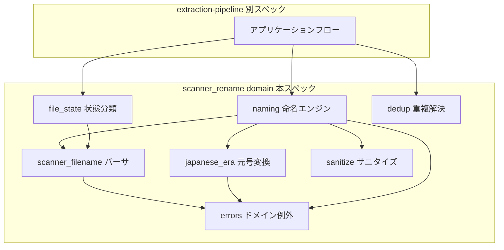
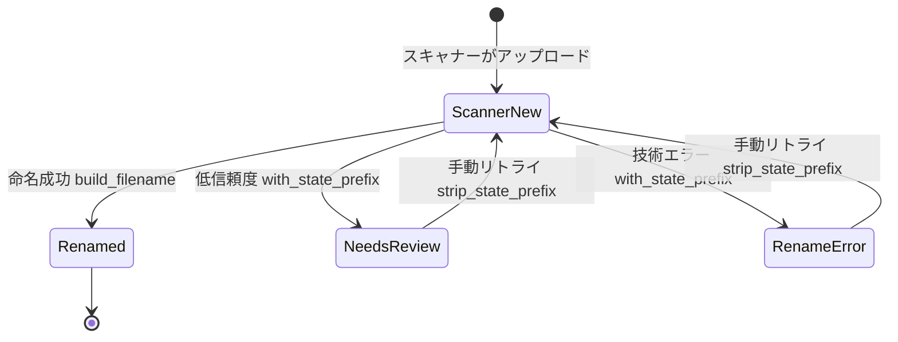

# Design Document: core-naming-engine

## Overview

**Purpose**: 本機能は、スキャン PDF 自動リネームシステムの最下層となる純 Python ドメイン層を提供する。スキャナー生成ファイル名の解釈・状態分類、日付・元号変換、抽出メタデータからの人間可読ファイル名の生成、重複解決とサニタイズを、外部 I/O ゼロの関数・値オブジェクト群として実装する。

**Users**: extraction-pipeline（アプリケーションフロー）が唯一の消費者であり、本ドメイン API を通じてファイル名の判定・生成を行う。

**Impact**: `src/scanner_rename/` は現在空パッケージであり、本設計で `domain/` サブパッケージを新設する。既存コードへの変更はない。

### Goals

- スキャナー生成名・状態プレフィックス・生成名のファイル名状態機械を型で表現する
- `docs/initial-context.md` の命名合意（フォーマット・省略規則・元号表記）を決定的な純関数としてコード化する
- 全受入基準を pytest `unit` マーカーの単体テストで検証可能にする

### Non-Goals

- Drive 上の実リネーム・ファイル一覧取得（extraction-pipeline / cloud-runtime-deploy の責務）
- OCR・LLM 呼び出し、抽出スキーマ（Gemini 構造化出力）の定義
- 発行元・期間を「含めるべきか」の有用性判定ポリシー（`app_llm_prompts/naming_policy.draft.md` に基づく LLM 側の責務）
- 信頼度閾値の判定（needs_review にするかどうかの決定はアプリ層）

## Boundary Commitments

### This Spec Owns

- ファイル名の状態機械: スキャナー生成名 / `_needs_review_` / `rename_error_` / 処理対象外の分類と相互変換
- 命名入力（`NamingInput`）の型定義: 抽出メタデータのうち命名に必要な部分の契約。extraction-pipeline はこの型に合わせて抽出結果をマッピングする
- ファイル名生成規則: コンポーネント連結・省略規則・元号表記・重複サフィックス・サニタイズ
- 日付・元号変換ユーティリティ

### Out of Boundary

- 抽出メタデータの完全スキーマ（信頼度・エビデンス等を含む）は extraction-pipeline が所有する。本スペックは命名に必要な射影（`NamingInput`）のみ定義する
- どの状態遷移をいつ実行するか（needs_review の判断、リトライのトリガー）はアプリ層の責務
- 既存ファイル名一覧の取得（Drive API）。重複解決は呼び出し側が渡す一覧に対する純関数とする

### Allowed Dependencies

- Python 標準ライブラリのみ（`datetime`, `re`, `dataclasses`, `enum` 等）。サードパーティ依存を追加しない
- `src/scanner_rename/domain/` 内部のモジュール間依存は後述の依存方向に従う

### Revalidation Triggers

- `NamingInput` / `Period` のフィールド追加・変更（extraction-pipeline の抽出スキーマとのマッピングに影響）
- 状態プレフィックス文字列（`_needs_review_` / `rename_error_`）の変更（運用手順・監視に影響）
- 命名フォーマット（コンポーネント順・区切り文字・元号表記）の変更（既存リネーム済みファイルとの一貫性に影響）
- 公開 API（`scanner_rename.domain` の再エクスポート）のシグネチャ変更

## Architecture

### Architecture Pattern & Boundary Map

ポート/アダプタ構成の最下層（ドメイン層）。本スペックにはポートすら存在せず、すべて純関数と frozen dataclass による値オブジェクトで構成する。



**Architecture Integration**:

- Selected pattern: 純粋ドメイン層（値オブジェクト + 純関数）。クラス階層やサービスオブジェクトは導入しない
- Domain boundaries: モジュール = 責務。各モジュールは単一の関心事のみ持つ
- Steering compliance: `structure.md` の「外部サービス依存のない純粋 Python ロジックをコアに置く」に準拠
- 依存方向（左から右へのみ import 可）: `errors` → `scanner_filename` / `japanese_era` / `sanitize` → `file_state` / `dedup` → `naming`。上位層への import は禁止

### Technology Stack

| Layer    | Choice / Version              | Role in Feature      | Notes                                     |
| -------- | ----------------------------- | -------------------- | ----------------------------------------- |
| Language | Python >= 3.13（既存設定）    | ドメインロジック実装 | 標準ライブラリのみ、依存追加なし          |
| Testing  | pytest >= 8 + `unit` マーカー | 単体テスト           | `pyproject.toml` の既存マーカー定義を使用 |
| Quality  | Ruff / Pyright（既存設定）    | lint・型検査         | 全公開 API に型ヒント必須                 |

## File Structure Plan

### Directory Structure

```text
src/scanner_rename/
├── __init__.py                # 既存（変更なし）
└── domain/
    ├── __init__.py            # 公開 API の再エクスポート（消費者向け契約面）
    ├── errors.py              # ドメイン例外階層
    ├── scanner_filename.py    # スキャナー生成名のパース・検証・値オブジェクト
    ├── file_state.py          # 状態プレフィックスの付与・除去・分類
    ├── japanese_era.py        # 元号テーブル、西暦⇔元号変換、日付コンポーネント整形
    ├── sanitize.py            # ファイル名サニタイズ（文字置換・長さ制限）
    ├── dedup.py               # 重複サフィックス解決
    └── naming.py              # NamingInput / Period と命名エンジン本体

tests/unit/
├── __init__.py
├── test_scanner_filename.py
├── test_file_state.py
├── test_japanese_era.py
├── test_sanitize.py
├── test_dedup.py
└── test_naming.py
```

### Modified Files

- なし（新規追加のみ。`src/scanner_rename/__init__.py` は変更しない）

## Requirements Traceability

| Requirement | Summary                  | Components                    | Interfaces                                                     |
| ----------- | ------------------------ | ----------------------------- | -------------------------------------------------------------- |
| 1.1–1.5     | スキャナー名パース・検証 | scanner_filename              | `parse_scanner_filename`, `ScannerFilename`                    |
| 2.1–2.5     | 状態プレフィックス       | file_state                    | `classify_filename`, `with_state_prefix`, `strip_state_prefix` |
| 3.1–3.6     | 日付・元号変換           | japanese_era                  | `era_to_gregorian`, `to_era`, `format_date_component`          |
| 4.1–4.9     | 命名エンジン             | naming（era/sanitize を利用） | `NamingInput`, `Period`, `build_filename`                      |
| 5.1–5.6     | 重複解決・サニタイズ     | dedup, sanitize               | `resolve_duplicate`, `sanitize_filename`                       |
| 6.1–6.4     | 純粋性・テスト容易性     | 全モジュール + tests/unit     | 単体テスト、標準ライブラリのみの実装                           |

## Components and Interfaces

| Component        | Domain/Layer | Intent                             | Req Coverage | Key Dependencies                                        | Contracts |
| ---------------- | ------------ | ---------------------------------- | ------------ | ------------------------------------------------------- | --------- |
| errors           | domain       | ドメイン例外の基底と種別           | 3.6, 4.8     | なし                                                    | Service   |
| scanner_filename | domain       | スキャナー生成名のパース・検証     | 1.1–1.5      | errors (P2)                                             | Service   |
| file_state       | domain       | 状態プレフィックス付与・除去・分類 | 2.1–2.5      | scanner_filename (P0)                                   | Service   |
| japanese_era     | domain       | 西暦⇔元号変換と日付整形            | 3.1–3.6      | errors (P1)                                             | Service   |
| sanitize         | domain       | ファイル名サニタイズ               | 5.4–5.6      | なし                                                    | Service   |
| dedup            | domain       | 重複サフィックス解決               | 5.1–5.3      | なし                                                    | Service   |
| naming           | domain       | 命名入力からのファイル名組み立て   | 4.1–4.9      | japanese_era (P0), sanitize (P0), scanner_filename (P1) | Service   |

### domain/errors

| Field        | Detail                                 |
| ------------ | -------------------------------------- |
| Intent       | ドメイン層の失敗を型で区別する例外階層 |
| Requirements | 3.6, 4.8                               |

**Responsibilities & Constraints**

- 基底 `DomainError(Exception)` と、`EraConversionError`（元号範囲外）、`NamingInputError`（タイトル欠落等の入力不備）を定義
- 例外メッセージは診断可能な内容（入力値の要約）を含む。シークレットや長大テキストは含めない

##### Service Interface

```python
class DomainError(Exception): ...
class EraConversionError(DomainError): ...
class NamingInputError(DomainError): ...
```

### domain/scanner_filename

| Field        | Detail                                               |
| ------------ | ---------------------------------------------------- |
| Intent       | スキャナー生成名を構造化された値として解釈・復元する |
| Requirements | 1.1, 1.2, 1.3, 1.4, 1.5                              |

**Responsibilities & Constraints**

- パターン `^\d{14}_\d{3}\.pdf$` の判定とタイムスタンプの `datetime` 変換を一箇所に集約する（正規表現はこのモジュールのみが所有）
- 不一致・無効日時は例外ではなく `None` で表現する（「該当しない」は正常系の分岐であるため）
- `ScannerFilename` は frozen dataclass。`original_name` で元文字列を復元できる（ラウンドトリップ保証）

##### Service Interface

```python
@dataclass(frozen=True)
class ScannerFilename:
    scan_timestamp: datetime  # naive、スキャナーローカル時刻
    sequence: int             # 1..999 の連番（先頭ゼロ埋め3桁で復元）

    @property
    def original_name(self) -> str: ...  # 例: "20260507132742_001.pdf"

def parse_scanner_filename(name: str) -> ScannerFilename | None: ...
```

- Preconditions: `name` は任意の文字列（ベース名。パスは含まない）
- Postconditions: 戻り値が非 `None` のとき `parse_scanner_filename(result.original_name) == result`
- Invariants: パターン不一致・カレンダー上無効な日時（月 13、時 25 等）は `None`

### domain/file_state

| Field        | Detail                                               |
| ------------ | ---------------------------------------------------- |
| Intent       | Drive ファイル名で表現される処理状態の分類と相互変換 |
| Requirements | 2.1, 2.2, 2.3, 2.4, 2.5                              |

**Responsibilities & Constraints**

- プレフィックス文字列定数 `NEEDS_REVIEW_PREFIX = "_needs_review_"` / `RENAME_ERROR_PREFIX = "rename_error_"` はこのモジュールのみが所有する
- 分類は「未処理スキャナー生成名 / needs_review / rename_error / 処理対象外」の 4 値。プレフィックス除去後の残りがスキャナー生成名パターンに一致しない場合は処理対象外
- 2 種のプレフィックスは相互に重複しない文字列であり、分類結果は判定順序に依存しない

##### Service Interface

```python
class FileState(Enum):
    SCANNER_NEW = "scanner_new"
    NEEDS_REVIEW = "needs_review"
    RENAME_ERROR = "rename_error"
    UNMANAGED = "unmanaged"

@dataclass(frozen=True)
class ClassifiedFilename:
    state: FileState
    scanner_filename: ScannerFilename | None  # UNMANAGED のとき None、それ以外は必須

def classify_filename(name: str) -> ClassifiedFilename: ...
def with_state_prefix(scanner: ScannerFilename, state: FileState) -> str: ...
def strip_state_prefix(name: str) -> str: ...
```

- Preconditions: `with_state_prefix` の `state` は `NEEDS_REVIEW` または `RENAME_ERROR` のみ（それ以外は `ValueError`）
- Postconditions: `strip_state_prefix(with_state_prefix(s, st)) == s.original_name`（手動リトライのラウンドトリップ）
- Invariants: `classify_filename` は例外を送出しない（全入力を 4 値のいずれかに分類する）

### domain/japanese_era

| Field        | Detail                                |
| ------------ | ------------------------------------- |
| Intent       | 西暦⇔元号の変換とファイル名用日付整形 |
| Requirements | 3.1, 3.2, 3.3, 3.4, 3.5, 3.6          |

**Responsibilities & Constraints**

- 元号テーブルはコード内の静的データとして所有する: 明治 M 1868-10-23 / 大正 T 1912-07-30 / 昭和 S 1926-12-25 / 平成 H 1989-01-08 / 令和 R 2019-05-01。改元日当日は新元号
- 外部ライブラリ（`japanera` 等）は採用しない（依存ゼロ方針、必要範囲が狭いため。research.md 参照）
- 将来の改元はテーブルへの 1 行追加で対応する

##### Service Interface

```python
class Era(Enum):  # value に (名称, 略号, 開始日) を保持
    MEIJI = ...; TAISHO = ...; SHOWA = ...; HEISEI = ...; REIWA = ...

@dataclass(frozen=True)
class EraDate:
    era: Era
    year: int  # 元号年（1 = 元年）

def to_era(d: date) -> EraDate: ...                       # 範囲外は EraConversionError
def era_to_gregorian(era: Era, year: int, month: int, day: int) -> date: ...
def format_date_component(d: date, *, with_era: bool) -> str: ...
```

- Postconditions: `format_date_component(date(2021,10,1), with_era=True) == "20211001(R3)"`、`with_era=False` なら `"20211001"`
- Invariants: `era_to_gregorian` の結果はその元号の適用期間内であること（範囲外指定は `EraConversionError`）。元号年 1 は略号表記で `R1` のように数字 1 を用いる

### domain/sanitize

| Field        | Detail                               |
| ------------ | ------------------------------------ |
| Intent       | ファイル名として安全な文字列への整形 |
| Requirements | 5.4, 5.5, 5.6                        |

**Responsibilities & Constraints**

- 置換対象: `/ \ : * ? " < > |` と制御文字（U+0000–U+001F, U+007F）→ `_` に置換。置換により連続した `_` は 1 つに畳む
- 先頭・末尾の空白とピリオドを除去する
- 上限長は 200 文字（`.pdf` 込み）。超過時はタイトル部分を短縮する前提でトランケート位置を呼び出し側（naming）が制御できるよう、部品単位のサニタイズ関数も提供する

##### Service Interface

```python
MAX_FILENAME_LENGTH: int  # 200

def sanitize_component(text: str) -> str: ...   # 1 コンポーネント（区切り _ を含まない）の整形
def sanitize_filename(name: str) -> str: ...    # ファイル名全体の最終ガード
```

- Postconditions: 戻り値に禁止文字・制御文字を含まない。`sanitize_filename` の戻り値は `MAX_FILENAME_LENGTH` 以下
- Invariants: 冪等（`sanitize_filename(sanitize_filename(x)) == sanitize_filename(x)`）

### domain/dedup

| Field        | Detail                                         |
| ------------ | ---------------------------------------------- |
| Intent       | 既存ファイル名一覧に対する重複サフィックス解決 |
| Requirements | 5.1, 5.2, 5.3                                  |

**Responsibilities & Constraints**

- 既存名一覧は呼び出し側（アプリ層が Drive から取得）が引数で渡す。本モジュールは I/O を持たない
- 比較は完全一致（大文字小文字を区別）。サフィックスは拡張子の直前に `_2`, `_3`, ... と挿入する

##### Service Interface

```python
def resolve_duplicate(candidate: str, existing_names: Collection[str]) -> str: ...
```

- Preconditions: `candidate` は拡張子 `.pdf` を持つサニタイズ済みファイル名
- Postconditions: 戻り値は `existing_names` に含まれない。`candidate` 自体が未使用ならそのまま返す
- Invariants: サフィックス番号は 2 から開始し、最小の未使用番号を返す（決定的）

### domain/naming

| Field        | Detail                                               |
| ------------ | ---------------------------------------------------- |
| Intent       | 命名入力から合意フォーマットのファイル名を組み立てる |
| Requirements | 4.1, 4.2, 4.3, 4.4, 4.5, 4.6, 4.7, 4.8, 4.9          |

**Responsibilities & Constraints**

- `NamingInput` は extraction-pipeline との契約面。抽出スキーマ（信頼度・エビデンス等）からの射影マッピングは extraction-pipeline 側の責務
- 発行元・期間の「含める/含めない」の有用性判断は行わない。入力に値があれば含め、`None` なら省略する（機械的組み立て）
- 各コンポーネントは `sanitize_component` で整形してから `_` で連結し、最後に `sanitize_filename` で全体をガードする。長さ超過時はタイトルを優先的に短縮する（日付・期間・発行元・拡張子は保持）
- `対象` の語はエンジン自身が生成する固定文字列（`年分` / `年度分` 等）に含まれないことをテストで保証する。入力タイトル自体の語彙チェックは行わない（LLM 側ポリシーの責務）

##### Service Interface

```python
class PeriodKind(Enum):
    CALENDAR_YEAR = "calendar_year"   # YYYY年分
    FISCAL_YEAR = "fiscal_year"       # YYYY年度分(YYYYMM-YYYYMM)
    EXPLICIT_RANGE = "explicit_range" # YYYYMM-YYYYMM

@dataclass(frozen=True)
class YearMonth:
    year: int
    month: int  # 1..12

@dataclass(frozen=True)
class Period:
    kind: PeriodKind
    year: int | None = None              # CALENDAR_YEAR / FISCAL_YEAR で必須
    start: YearMonth | None = None       # FISCAL_YEAR / EXPLICIT_RANGE で必須
    end: YearMonth | None = None         # FISCAL_YEAR / EXPLICIT_RANGE で必須

@dataclass(frozen=True)
class NamingInput:
    title: str                        # 書類タイトル（必須）
    document_date: date | None        # None ならスキャンタイムスタンプにフォールバック
    date_has_era: bool                # ソース文書が元号表記か
    period: Period | None             # None なら期間コンポーネント省略
    issuer: str | None                # None なら発行元コンポーネント省略

def build_filename(naming_input: NamingInput, scanner: ScannerFilename) -> str: ...
```

- Preconditions: `scanner` は元ファイルのパース結果（フォールバック日付と診断情報のために常に必須）
- Postconditions: 戻り値は `<日付>_<期間>_<タイトル>_<発行元>.pdf` から該当しないコンポーネントを除いた形式。禁止文字を含まず 200 文字以下
- Invariants: `title` が空・空白のみなら `NamingInputError`。`Period` の必須フィールド欠落も `NamingInputError`。同一入力に対して決定的

**Implementation Notes**

- Integration: `domain/__init__.py` で `NamingInput`, `Period`, `PeriodKind`, `YearMonth`, `build_filename`, `parse_scanner_filename`, `ScannerFilename`, `FileState`, `ClassifiedFilename`, `classify_filename`, `with_state_prefix`, `strip_state_prefix`, `resolve_duplicate`, `sanitize_filename`, `Era`, `EraDate`, `to_era`, `era_to_gregorian`, `format_date_component`, 例外型を再エクスポートし、消費者はここからのみ import する
- Validation: 全モジュールで Pyright を通過する型ヒント。Ruff の既存設定に準拠
- Risks: 命名フォーマットの将来変更（Revalidation Triggers 参照）。元号元年の表記（`R1`）は合意例に現れないため research.md に判断を記録

## Data Models

### Domain Model

すべて不変の値オブジェクト（frozen dataclass / Enum）であり、集約・永続化は存在しない。

- `ScannerFilename`: スキャナー生成名の構造（タイムスタンプ + 連番）。不変条件: カレンダー上有効な日時、連番の 3 桁復元
- `ClassifiedFilename`: ファイル名の状態分類結果。不変条件: `UNMANAGED` 以外では `scanner_filename` 非 `None`
- `EraDate`: 元号 + 元号年。不変条件: 元号の適用期間内
- `NamingInput` / `Period` / `YearMonth`: 命名契約。不変条件は naming コンポーネント参照

ファイル名状態機械（アプリ層が遷移を実行、本スペックは判定・変換関数を提供）:



## Error Handling

### Error Strategy

「該当しない」と「失敗」を区別する。判定系（パース・分類）は全入力が正常系であり `None` / `UNMANAGED` を返す。生成系（元号変換・命名）は満たせない前提を `DomainError` 派生例外で通知し、アプリ層（extraction-pipeline）がそれを `rename_error_` / `_needs_review_` への遷移判断に変換する。

### Error Categories and Responses

- 入力不備（`NamingInputError`）: タイトル欠落・`Period` フィールド不足。メッセージに欠落フィールド名を含める
- 範囲外（`EraConversionError`）: 元号対応表の範囲外の日付。メッセージに入力日付を含める
- 契約違反（`ValueError`）: `with_state_prefix` への不正な状態指定など、呼び出し側のプログラミングエラー

### Monitoring

本スペックはログ出力を行わない（純関数）。例外メッセージが上位層の構造化ログの材料となるため、診断可能な内容を含めることのみ保証する。

## Testing Strategy

すべて pytest `unit` マーカー。外部サービス・ファイル I/O なし（6.1–6.4）。

### Unit Tests

- scanner_filename: 正常パース（例 `20260507132742_001.pdf`）、ラウンドトリップ（1.5）、無効日時（月 13・日 32・時 25）と非一致パターン（拡張子違い・桁違い・前後余分文字）の網羅パラメタライズ（1.1–1.4）
- file_state: 2 種プレフィックスの付与・除去ラウンドトリップ（2.1, 2.2, 2.4）、4 値分類の境界（プレフィックスのみ・除去後が非スキャナー名・無関係な名前）（2.3, 2.5）
- japanese_era: 各改元日当日と前日の境界パラメタライズ（3.3）、双方向変換の整合（3.1, 3.2）、`20211001(R3)` 生成と西暦のみ整形（3.4, 3.5）、範囲外エラー（3.6）
- naming: initial-context.md の合意例 3 件（住宅ローン証明書・確定申告書・医療費通知）の完全一致再現（4.1–4.3）、省略規則の組み合わせ（期間なし・発行元なし・両方なし）（4.5, 4.6）、明示的期間（4.4）、日付フォールバック（4.7）、タイトル欠落エラー（4.8）、生成固定文字列に `対象` を含まない検証（4.9）
- sanitize / dedup: 禁止文字置換・トリム・冪等性（5.4, 5.5）、長さ超過時のタイトル短縮（5.6）、`_2`〜`_n` の逐次解決と非重複時の素通し（5.1–5.3）
- 純粋性: `scanner_rename.domain` 配下のモジュールが標準ライブラリ以外を import しないことの静的検証テスト（6.1）

### Integration Tests

本スペック単体では対象外（ポートを持たないため）。extraction-pipeline の `integration_fake` テストが本 API を経由して検証する。
