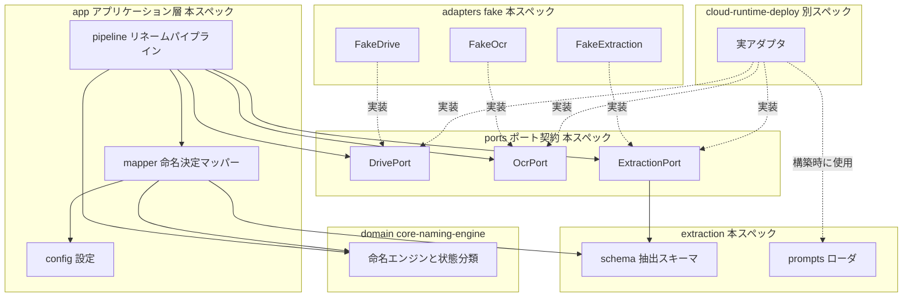
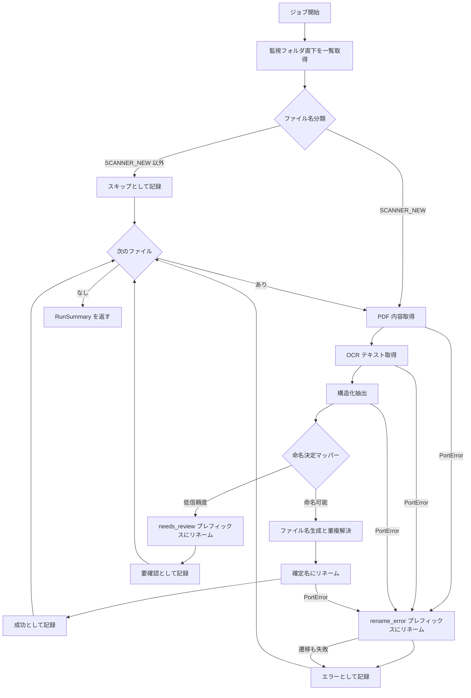

# Design Document: extraction-pipeline

## Overview

**Purpose**: 本機能は、スキャン PDF 自動リネームシステムのアプリケーション層を提供する。監視フォルダ直下の未処理スキャン PDF を検出し、OCR → 構造化抽出 → 命名 → リネーム → 状態遷移のフロー全体をオーケストレーションする。外部サービスへのアクセスは 3 つのポート（Drive / OCR / LLM 抽出）に閉じ込め、フェイクアダプタだけでフロー全体をローカル検証可能にする。

**Users**: 運用者（本人）が Drive 上で自動リネームの結果・要確認・エラー状態を受け取る。下流スペック cloud-runtime-deploy（実アダプタ・ジョブ実行）と gcp-test-broker（フィクスチャ）は本スペックが定義するポート契約・抽出スキーマの消費者である。

**Impact**: `src/scanner_rename/` に `ports/`・`extraction/`・`adapters/fake/`・`app/` を新設する。core-naming-engine が定義する `domain/` API を消費する（変更しない）。`app_llm_prompts/` のドラフト 2 件を確定版に昇格する。

### Goals

- 3 ポート（Drive / OCR / LLM 抽出）の契約を確定し、フェイク・Broker フィクスチャ・実アダプタが共有するシームとする
- Gemini 構造化出力スキーマ（信頼度・エビデンス付き）と `NamingInput` への変換規則をコード化する
- 低信頼度（`_needs_review_`）と技術エラー（`rename_error_`）の分岐、ファイル単位の障害分離を実装する
- pytest `integration_fake` で外部サービスなしにフロー全体を検証する

### Non-Goals

- 実アダプタ（Google Drive API / Document AI / Gemini 呼び出し・認証）— cloud-runtime-deploy
- ホスト側 GCP Test Broker とそのフィクスチャ API — gcp-test-broker
- インフラレベルのリトライ（Cloud Run Job 再試行、API レート制限）、構造化ログ基盤・通知 — cloud-runtime-deploy
- 命名規則・状態プレフィックスの定義そのもの — core-naming-engine
- 複数文書 PDF の分割（1 PDF = 1 文書）

## Boundary Commitments

### This Spec Owns

- 3 ポート契約: `DrivePort` / `OcrPort` / `ExtractionPort` のメソッドシグネチャ、DTO、例外階層（`PortError` 派生）
- 抽出メタデータスキーマ: `DocumentExtraction` と構成フィールド型（Gemini 構造化出力の入出力型）
- 抽出スキーマ → `NamingInput` への変換規則と信頼度ゲート（要確認判定）
- アプリケーションフローのオーケストレーションと、アプリレベルのエラーハンドリングポリシー（状態遷移・障害分離・処理結果要約）
- フェイクアダプタ 3 種（ポート契約の参照実装）
- `app_llm_prompts/` の確定版プロンプト素材（extraction_policy.md / naming_policy.md）とそのローダ

### Out of Boundary

- `NamingInput` / `Period` / `FileState` の型定義と命名・状態遷移関数の実装（core-naming-engine 所有。本スペックは消費のみ）
- 実サービスへの接続・認証・SDK 例外の詳細（cloud-runtime-deploy。ただし SDK 例外を `PortError` 派生へ変換する義務は本契約の一部）
- Broker API の形状（gcp-test-broker。フィクスチャは本スペックのポート契約・スキーマに整合させる）
- ジョブのエントリポイント（CLI / Cloud Run Job main）・構造化ログ出力先・通知（cloud-runtime-deploy。本スペックは処理結果の要約を返すところまで）

### Allowed Dependencies

- `scanner_rename.domain`（core-naming-engine の公開 API）のみを上流コードとして import する
- Python 標準ライブラリ。サードパーティのランタイム依存を追加しない（pytest は dev 依存として既存）
- モジュール依存方向（左から右へのみ import 可）: `domain` → `extraction/schema` → `ports` → `adapters/fake` / `app`。`extraction/prompts` は独立（標準ライブラリのみ）。逆方向・`app` から `adapters` への import は禁止（アダプタは合成時に注入する）

### Revalidation Triggers

- ポートのメソッドシグネチャ・DTO・例外階層の変更（gcp-test-broker のフィクスチャ、cloud-runtime-deploy の実アダプタに影響。3 スペック横断レビュー必須）
- `DocumentExtraction` のフィールド追加・変更（確定版 extraction_policy.md、Broker の抽出フィクスチャ、実アダプタの response schema に影響）
- 確定版プロンプト素材のファイル名・配置の変更（cloud-runtime-deploy のパッケージングに影響）
- 処理結果要約（`RunSummary` / `FileOutcome`）の形状変更（cloud-runtime-deploy の構造化ログ・アラート条件に影響）
- 信頼度ゲートの判定対象フィールドの変更（運用者の要確認レビュー頻度に影響）

## Architecture

### Architecture Pattern & Boundary Map

ヘキサゴナル（ポート/アダプタ）。アプリケーションサービスがポート（Protocol）にのみ依存し、アダプタ実装は合成時に注入される。



**Architecture Integration**:

- Selected pattern: ヘキサゴナル。steering（tech.md / structure.md）の「ドメインロジックとインフラアダプターの分離」に準拠し、brief の既定方針
- Domain boundaries: ポート契約 = 3 スペック共有シーム。抽出スキーマは本スペック所有、命名契約（`NamingInput`）は上流所有
- ポートは `typing.Protocol` で定義する（構造的部分型。アダプタは継承不要で、Pyright が契約適合を静的検証する。research.md 参照）
- プロンプト素材はポートのシグネチャに載せない。実アダプタが構築時に `prompts` ローダで読み込んで保持する（フェイクはプロンプト不要）

### Technology Stack

| Layer     | Choice / Version                                   | Role in Feature                | Notes                                      |
| --------- | -------------------------------------------------- | ------------------------------ | ------------------------------------------ |
| Language  | Python >= 3.13（既存設定）                         | アプリ層・ポート・フェイク実装 | 標準ライブラリのみ、ランタイム依存追加なし |
| Contracts | `typing.Protocol` + frozen dataclass               | ポート契約と DTO               | Pyright で適合を静的検証                   |
| Prompts   | `app_llm_prompts/*.md`（ADR 0005）                 | ランタイム LLM 指示素材        | 実行時にファイル読み込み                   |
| Testing   | pytest >= 8 + `unit` / `integration_fake` マーカー | 単体・フェイク統合テスト       | 既存マーカー定義を使用。外部サービス不要   |
| Quality   | Ruff / Pyright（既存設定）                         | lint・型検査                   | 全公開 API に型ヒント必須                  |

## File Structure Plan

### Directory Structure

```text
src/scanner_rename/
├── domain/                    # core-naming-engine 所有（変更しない）
├── extraction/
│   ├── __init__.py            # 抽出スキーマ・プロンプトローダの再エクスポート
│   ├── schema.py              # DocumentExtraction と構成フィールド型（Gemini 構造化出力スキーマ）
│   └── prompts.py             # 確定版プロンプト素材のローダ（存在・非空検証）
├── ports/
│   ├── __init__.py            # ポート契約の再エクスポート（3 スペック共有の契約面）
│   ├── errors.py              # PortError 基底と派生（DriveError / OcrError / ExtractionError）
│   ├── drive.py               # DrivePort + DriveFile
│   ├── ocr.py                 # OcrPort + OcrResult
│   └── extraction.py          # ExtractionPort
├── adapters/
│   ├── __init__.py
│   └── fake/
│       ├── __init__.py
│       ├── fake_drive.py      # インメモリの監視フォルダ（一覧・取得・リネーム・故障注入）
│       ├── fake_ocr.py        # 決定論的な OCR 応答（登録済みテキスト・故障注入）
│       └── fake_extraction.py # 決定論的な抽出応答（登録済み DocumentExtraction・故障注入）
└── app/
    ├── __init__.py            # アプリ層公開 API の再エクスポート
    ├── config.py              # PipelineConfig（信頼度閾値等）
    ├── mapper.py              # DocumentExtraction → 命名決定（ReadyToName | NeedsReview）
    └── pipeline.py            # RenamePipeline（フロー全体・エラーハンドリング・RunSummary）

app_llm_prompts/
├── README.md                  # 初期ファイル記述の更新（ドラフト → 確定版）
├── extraction_policy.md       # 確定版抽出ポリシー（draft を改稿・改名）
└── naming_policy.md           # 確定版命名ポリシー（draft を改稿・改名）

tests/
├── unit/
│   ├── test_extraction_schema.py   # スキーマ不変条件
│   ├── test_prompts_loader.py      # ローダの正常系・欠落エラー
│   ├── test_mapper.py              # 信頼度ゲート・フォールバック・省略規則
│   └── test_fake_adapters.py       # フェイクのポート契約適合・故障注入
└── integration_fake/
    ├── __init__.py
    ├── conftest.py                 # フェイク一式とパイプラインの組み立てフィクスチャ
    ├── test_pipeline_success.py    # 成功フロー（合意 3 例・重複解決・スキップ）
    └── test_pipeline_failures.py   # 要確認・エラー遷移・障害分離・手動リトライ
```

### Modified Files

- `app_llm_prompts/extraction_policy.draft.md` → `extraction_policy.md` へ改稿・改名（構造化出力スキーマの確定記述を含む）
- `app_llm_prompts/naming_policy.draft.md` → `naming_policy.md` へ改稿・改名
- `app_llm_prompts/README.md` — 初期ファイル一覧をドラフトから確定版に更新
- `src/scanner_rename/__init__.py` は変更しない

## System Flows

1 回のジョブ実行のフロー（ファイル単位の try 境界が障害分離を担う）:



フローレベルの決定事項:

- 分類（`classify_filename`）で `SCANNER_NEW` のみ処理。他状態はファイルに触れずスキップ記録のみ（1.3, 1.5）
- 重複解決は「初回一覧のファイル名 + 本実行で確定した名前」の集合に対して行う（同一バッチ内の衝突も解決、3.4, 3.5）
- ファイル単位の try は `PortError` / `DomainError` に加えて予期しない `Exception` も捕捉する（隔離要件 5.3 のため。記録に例外種別を残す）
- リトライは行わない（インフラレベルのリトライは cloud-runtime-deploy 所有）

## Requirements Traceability

| Requirement | Summary                | Components                                   | Interfaces                                            |
| ----------- | ---------------------- | -------------------------------------------- | ----------------------------------------------------- |
| 1.1–1.5     | 処理対象の検出と選別   | pipeline, ports/drive                        | `DrivePort.list_files`, `classify_filename`（domain） |
| 2.1         | OCR テキスト取得       | pipeline, ports/ocr                          | `OcrPort.recognize`, `OcrResult`                      |
| 2.2–2.6     | 構造化抽出とスキーマ   | extraction/schema, ports/extraction, prompts | `ExtractionPort.extract`, `DocumentExtraction`        |
| 3.1–3.3     | 命名入力への変換       | app/mapper, app/config                       | `to_naming_decision`, `ReadyToName`                   |
| 3.4–3.6     | 重複解決とリネーム実行 | app/pipeline                                 | `resolve_duplicate`（domain）, `DrivePort.rename`     |
| 4.1–4.4     | 要確認遷移             | app/mapper, app/pipeline, app/config         | `NeedsReview`, `with_state_prefix`（domain）          |
| 5.1–5.6     | 技術エラーと障害分離   | app/pipeline, ports/errors                   | `PortError`, `FileOutcome`, `RunSummary`              |
| 6.1–6.5     | プロンプト素材の確定   | extraction/prompts, app_llm_prompts          | `load_prompt`, extraction_policy.md, naming_policy.md |
| 7.1–7.5     | 外部サービスなし検証   | adapters/fake, tests                         | 3 ポート契約, フェイク 3 種, integration_fake テスト  |

## Components and Interfaces

| Component              | Domain/Layer   | Intent                           | Req Coverage                        | Key Dependencies                      | Contracts      |
| ---------------------- | -------------- | -------------------------------- | ----------------------------------- | ------------------------------------- | -------------- |
| extraction/schema      | 契約（データ） | 構造化抽出の出力型               | 2.2–2.6                             | なし                                  | State          |
| ports/errors           | 契約           | ポート失敗の例外階層             | 5.1, 7.3                            | なし                                  | Service        |
| ports/drive            | 契約           | 監視フォルダ操作の抽象           | 1.1, 3.6, 7.1                       | errors (P0)                           | Service        |
| ports/ocr              | 契約           | OCR の抽象                       | 2.1, 7.1                            | errors (P0)                           | Service        |
| ports/extraction       | 契約           | 構造化抽出の抽象                 | 2.2, 7.1                            | schema (P0), errors (P0)              | Service        |
| extraction/prompts     | 基盤           | 確定版プロンプトのローダ         | 6.1–6.4                             | なし                                  | Service        |
| adapters/fake          | テスト基盤     | ポート契約の決定論的参照実装     | 7.2, 7.3                            | ports (P0), schema (P0)               | Service        |
| app/config             | アプリ         | パイプライン設定                 | 4.2                                 | なし                                  | State          |
| app/mapper             | アプリ         | 抽出結果 → 命名決定              | 3.1–3.3, 4.1, 4.3                   | schema (P0), domain (P0), config (P0) | Service        |
| app/pipeline           | アプリ         | フロー全体のオーケストレーション | 1.1–1.5, 3.4–3.6, 4.1, 4.4, 5.1–5.6 | ports (P0), mapper (P0), domain (P0)  | Service, Batch |
| app_llm_prompts 確定版 | ランタイム素材 | 抽出・命名の LLM 指示            | 6.1–6.5                             | schema との整合 (P1)                  | —              |

### 契約レイヤ

#### extraction/schema

| Field        | Detail                                                                    |
| ------------ | ------------------------------------------------------------------------- |
| Intent       | Gemini 構造化出力に対応する抽出メタデータの型定義（本スペック所有の契約） |
| Requirements | 2.2, 2.3, 2.4, 2.5, 2.6                                                   |

**Responsibilities & Constraints**

- すべて frozen dataclass / Enum の不変値オブジェクト。欠落フィールドは `None` で表現する（推測値で埋めない）
- 不変条件（信頼度 0.0–1.0、期間種別ごとの必須フィールド）を `__post_init__` で検証し、違反は `ValueError`（アダプタが `ExtractionError` に変換する）
- 期間はドメイン `Period` の 3 分類（年分・年度分・明示期間）と 1:1 対応する単一の判別型（research.md の決定）

##### Service Interface

```python
@dataclass(frozen=True)
class ExtractedDate:
    value: date                      # 西暦に正規化済み
    source_uses_japanese_era: bool
    japanese_era: str | None         # 例: "R3"。source_uses_japanese_era が False なら None
    evidence: str                    # 短い抜粋
    confidence: float                # 0.0–1.0

@dataclass(frozen=True)
class ExtractedText:
    value: str                       # 空文字列は不可（欠落はフィールド自体を None に）
    evidence: str
    confidence: float

class ExtractedPeriodKind(Enum):
    CALENDAR_YEAR = "calendar_year"    # YYYY年分
    FISCAL_YEAR = "fiscal_year"        # YYYY年度分(YYYYMM-YYYYMM)
    EXPLICIT_RANGE = "explicit_range"  # YYYYMM-YYYYMM

@dataclass(frozen=True)
class ExtractedPeriod:
    kind: ExtractedPeriodKind
    year: int | None                 # CALENDAR_YEAR / FISCAL_YEAR で必須
    start_year_month: str | None     # "YYYYMM"。FISCAL_YEAR / EXPLICIT_RANGE で必須
    end_year_month: str | None       # "YYYYMM"。FISCAL_YEAR / EXPLICIT_RANGE で必須
    evidence: str
    confidence: float

@dataclass(frozen=True)
class DocumentExtraction:
    document_date: ExtractedDate | None
    title: ExtractedText | None
    issuer: ExtractedText | None
    document_type: ExtractedText | None
    period: ExtractedPeriod | None
    reason: str                      # 抽出判断の短い説明
```

- Invariants: `confidence` は 0.0–1.0。`ExtractedPeriod` の種別ごとの必須フィールド欠落は `ValueError`。`evidence` に OCR 全文を入れない運用はプロンプト側の指示とし、型では強制しない

#### ports/errors

| Field        | Detail                                                     |
| ------------ | ---------------------------------------------------------- |
| Intent       | 外部サービス失敗を型で区別する例外階層（ポート契約の一部） |
| Requirements | 5.1, 7.3                                                   |

##### Service Interface

```python
class PortError(Exception): ...        # メッセージは診断可能な要約。認証情報・OCR 全文を含めない
class DriveError(PortError): ...
class OcrError(PortError): ...
class ExtractionError(PortError): ...
```

- Invariants: 全アダプタ（フェイク・Broker フィクスチャ経由・実）は基盤側の例外を対応する `PortError` 派生に変換して送出する。ポートから他の例外型を意図的に送出しない

#### ports/drive

| Field        | Detail                                                                       |
| ------------ | ---------------------------------------------------------------------------- |
| Intent       | 監視フォルダ（`/From_BrotherDevice` 直下）にスコープされたファイル操作の抽象 |
| Requirements | 1.1, 1.4, 3.6, 7.1                                                           |

**Responsibilities & Constraints**

- ポートは監視フォルダにスコープ済み。フォルダの解決（パス → ID）や指定はアダプタ構築時の関心事であり、メソッド引数に持たせない
- `list_files` は直下のファイルのみ返す（サブフォルダとその中身を含めない）。この保証はアダプタ実装の義務（契約の事後条件）

##### Service Interface

```python
@dataclass(frozen=True)
class DriveFile:
    file_id: str    # アダプタ内で一意・安定
    name: str       # ベース名（パスを含まない）

class DrivePort(Protocol):
    def list_files(self) -> list[DriveFile]: ...
    def download(self, file_id: str) -> bytes: ...
    def rename(self, file_id: str, new_name: str) -> None: ...
```

- Preconditions: `download` / `rename` の `file_id` は `list_files` が返したもの
- Postconditions: `rename` 成功後の `list_files` は新しい名前を返す
- Invariants: 失敗は `DriveError`（存在しない file_id、基盤障害等）。`list_files` は監視フォルダ直下のみを返す

#### ports/ocr

| Field        | Detail                                  |
| ------------ | --------------------------------------- |
| Intent       | PDF バイト列から OCR テキストを得る抽象 |
| Requirements | 2.1, 7.1                                |

##### Service Interface

```python
@dataclass(frozen=True)
class OcrResult:
    text: str    # 全文テキスト（v1 はレイアウト情報を扱わない）

class OcrPort(Protocol):
    def recognize(self, pdf_content: bytes) -> OcrResult: ...
```

- Invariants: 失敗は `OcrError`。空文書は `text=""` の正常応答（失敗ではない。低信頼度抽出として下流で扱われる）

#### ports/extraction

| Field        | Detail                                     |
| ------------ | ------------------------------------------ |
| Intent       | OCR テキストから構造化メタデータを得る抽象 |
| Requirements | 2.2, 2.4, 2.5, 2.6, 7.1                    |

**Responsibilities & Constraints**

- プロンプト素材（抽出・命名ポリシー）は実装アダプタが構築時に受け取り保持する。ポートのシグネチャには現れない
- 応答がスキーマ不変条件を満たせない場合（LLM 出力の破損等）、アダプタは `ExtractionError` を送出する

##### Service Interface

```python
class ExtractionPort(Protocol):
    def extract(self, ocr_result: OcrResult) -> DocumentExtraction: ...
```

- Postconditions: 戻り値はスキーマ不変条件を満たす `DocumentExtraction`
- Invariants: 失敗（呼び出し障害・不正応答）は `ExtractionError`

### 基盤レイヤ

#### extraction/prompts

| Field        | Detail                                   |
| ------------ | ---------------------------------------- |
| Intent       | 確定版プロンプト素材の読み込みと存在検証 |
| Requirements | 6.1, 6.2, 6.3, 6.4                       |

**Responsibilities & Constraints**

- 実行のたびにファイルから読み込む（プロセス内キャッシュはアダプタ構築単位。ジョブは実行ごとに新プロセスのため、編集は次回実行から反映される）
- 欠落・空ファイルは `PromptLoadError` で即時失敗（暗黙のデフォルトなし）
- 確定版ファイル名の定数（`extraction_policy.md` / `naming_policy.md`）はこのモジュールのみが所有する

##### Service Interface

```python
class PromptLoadError(Exception): ...

EXTRACTION_POLICY_FILENAME: str  # "extraction_policy.md"
NAMING_POLICY_FILENAME: str      # "naming_policy.md"

@dataclass(frozen=True)
class PromptMaterials:
    extraction_policy: str
    naming_policy: str

def load_prompt_materials(prompts_dir: Path) -> PromptMaterials: ...
```

- Postconditions: 戻り値の両フィールドは非空文字列
- Invariants: ファイル欠落・空・読み込み不能は `PromptLoadError`（メッセージに対象パスを含める）

#### adapters/fake（FakeDrive / FakeOcr / FakeExtraction）

| Field        | Detail                                                          |
| ------------ | --------------------------------------------------------------- |
| Intent       | ポート契約の決定論的な参照実装（integration_fake テストの土台） |
| Requirements | 7.2, 7.3, 7.4                                                   |

**Responsibilities & Constraints**

- `FakeDrive`: インメモリの `{file_id: (name, content)}`。`list_files` は決定的順序（file_id 昇順）で返す。存在しない file_id は `DriveError`。指定ファイル・指定操作で `DriveError` を送出する故障注入を備える
- `FakeOcr`: PDF 内容（バイト列）をキーに登録済み `OcrResult` を返す。未登録内容は `OcrError`。故障注入を備える
- `FakeExtraction`: OCR テキストをキーに登録済み `DocumentExtraction` を返す。未登録は `ExtractionError`。故障注入を備える
- ネットワーク・ファイル I/O・時刻依存なし。すべて構築時に与えたデータのみで動作する（決定論）
- 故障注入は「正常応答と失敗の表現がポート契約に従う」ことの検証手段であり、契約外の挙動を追加しない

**Implementation Notes**

- Integration: Pyright がポート Protocol への適合を静的検証する（継承なし）。`tests/unit/test_fake_adapters.py` で契約（事後条件・例外型・決定的順序）を検証
- Risks: フェイクの挙動が実サービスと乖離する可能性 → 契約に書かれた範囲のみを再現し、契約外のふるまい（レート制限等）は模倣しない方針を明記

### アプリケーションレイヤ

#### app/config

| Field        | Detail                         |
| ------------ | ------------------------------ |
| Intent       | パイプラインの調整可能な設定値 |
| Requirements | 4.2                            |

##### Service Interface

```python
@dataclass(frozen=True)
class PipelineConfig:
    confidence_threshold: float = 0.7   # 要確認判定・コンポーネント省略に共通で用いる閾値
```

- Invariants: `0.0 <= confidence_threshold <= 1.0`（違反は `ValueError`）。実行環境からの値の受け渡し（環境変数等）は cloud-runtime-deploy の責務で、本スペックはコンストラクタ注入のみ

#### app/mapper

| Field        | Detail                                                                                  |
| ------------ | --------------------------------------------------------------------------------------- |
| Intent       | 抽出結果を信頼度ゲートにかけ、命名入力（`NamingInput`）または要確認判定に変換する純関数 |
| Requirements | 3.1, 3.2, 3.3, 4.1, 4.3                                                                 |

**Responsibilities & Constraints**

- 判定規則（confidence_threshold との比較はすべて「未満で不採用」）:
  - `title` が `None` または信頼度が閾値未満 → `NeedsReview`（理由にフィールド名と信頼度を含める）
  - `document_date` が `None` または閾値未満 → スキャンタイムスタンプの日付にフォールバック（`date_has_era=False`）
  - `issuer` / `period` が `None` または閾値未満 → 当該コンポーネントを省略（`None`）
  - `document_type` は命名に使用しない（処理結果の記録・診断用）
- 採用された `ExtractedDate` は `value`（西暦）と `source_uses_japanese_era` を `NamingInput.document_date` / `date_has_era` に射影する。元号文字列そのものは渡さない（元号表記の生成は domain の責務）
- `ExtractedPeriod` → `Period` の変換: kind を 1:1 対応させ、`start_year_month`/`end_year_month`（"YYYYMM"）を `YearMonth` にパースする。パース不能はマッピング不備として `ExtractionError` 相当の技術エラー（呼び出し側で捕捉）
- I/O を持たない決定的な純関数。低信頼度は例外ではなく戻り値で表現する（domain の「該当しない/失敗」区別の規約に整合）

##### Service Interface

```python
@dataclass(frozen=True)
class ReadyToName:
    naming_input: NamingInput

@dataclass(frozen=True)
class NeedsReview:
    reasons: tuple[str, ...]   # 例: ("title: missing",), ("title: confidence 0.42 < 0.70",)

NamingDecision = ReadyToName | NeedsReview

def to_naming_decision(
    extraction: DocumentExtraction,
    scanner: ScannerFilename,
    config: PipelineConfig,
) -> NamingDecision: ...
```

- Postconditions: `ReadyToName.naming_input.title` は非空。`NeedsReview.reasons` は非空タプル
- Invariants: 同一入力に対して決定的。例外を送出するのは変換不能な内部不整合（期間パース不能等）のみ

#### app/pipeline

| Field        | Detail                                                                                    |
| ------------ | ----------------------------------------------------------------------------------------- |
| Intent       | 1 回のジョブ実行のオーケストレーション（検出 → 抽出 → 命名 → リネーム → 状態遷移 → 要約） |
| Requirements | 1.1, 1.2, 1.3, 1.4, 1.5, 3.4, 3.5, 3.6, 4.1, 4.4, 5.1, 5.2, 5.3, 5.4, 5.5, 5.6            |

**Responsibilities & Constraints**

- ポート 3 種と設定をコンストラクタで受け取る（アダプタの選択・構築は呼び出し側 = テストや将来のエントリポイントの責務）
- ファイルごとの処理をファイル単位 try で囲み、`PortError` / `DomainError` / 予期しない `Exception` を `rename_error_` 遷移 + 記録に変換する。エラー遷移のリネームが `DriveError` で失敗した場合は記録のみで継続（5.2）
- 状態遷移名は domain の `with_state_prefix` で生成する（プレフィックス文字列を本層で持たない）
- 重複解決: 実行開始時の一覧の名前集合を保持し、確定した新名を逐次追加した集合に対して `resolve_duplicate` を適用する（3.4, 3.5）
- 手動リトライ（5.6）は分類の自然な帰結（スキャナー生成名に戻せば `SCANNER_NEW` に分類される）であり、本層に専用ロジックを持たない。integration_fake で挙動を固定する
- ログ出力基盤は持たない。`RunSummary` が上位（cloud-runtime-deploy の構造化ログ）の材料となるため、診断可能かつ機微情報を含まない要約とする（5.5: 例外は型名とメッセージ要約のみ記録し、OCR テキスト・PDF 内容を含めない）

##### Service Interface

```python
class OutcomeKind(Enum):
    RENAMED = "renamed"
    NEEDS_REVIEW = "needs_review"
    ERROR = "error"
    SKIPPED = "skipped"

@dataclass(frozen=True)
class FileOutcome:
    file_id: str
    original_name: str
    kind: OutcomeKind
    new_name: str | None       # RENAMED / NEEDS_REVIEW / ERROR で遷移後の名前。遷移失敗・SKIPPED は None
    detail: str                # スキップ理由・NeedsReview 理由・例外要約など

@dataclass(frozen=True)
class RunSummary:
    outcomes: tuple[FileOutcome, ...]

class RenamePipeline:
    def __init__(
        self,
        drive: DrivePort,
        ocr: OcrPort,
        extraction: ExtractionPort,
        config: PipelineConfig,
    ) -> None: ...

    def run(self) -> RunSummary: ...
```

##### Batch / Job Contract

- Trigger: 呼び出し側が `run()` を 1 回呼ぶ（スケジューリング・エントリポイントは cloud-runtime-deploy）
- Input / validation: 入力は Drive の現在状態のみ。事前条件なし
- Output / destination: `RunSummary`（Drive 上の副作用はリネームのみ）
- Idempotency & recovery: 処理対象の判定がファイル名分類に基づくため、成功・要確認・エラーに遷移済みのファイルは再実行で再処理されない（自然な冪等性）。実行途中の失敗は次回実行で未処理分のみ処理される

**Implementation Notes**

- Integration: `run()` は例外を送出せず必ず `RunSummary` を返す（一覧取得自体の失敗のみ例外で伝播 — ジョブ全体が成立しないため。この一点は Batch Contract の例外として明記）
- Validation: integration_fake で成功・要確認・エラー・混在・0 件・手動リトライの全シナリオを固定
- Risks: 広い `Exception` 捕捉によるバグ潜伏 → `detail` に例外型名を必ず含め、テストで検証

### ランタイム素材

#### app_llm_prompts 確定版（extraction_policy.md / naming_policy.md）

| Field        | Detail                                                    |
| ------------ | --------------------------------------------------------- |
| Intent       | 構造化抽出・命名判断のための自然言語 LLM 指示（ADR 0005） |
| Requirements | 6.1, 6.2, 6.5                                             |

**Responsibilities & Constraints**

- extraction_policy.md: ドラフトの内容（日付優先順位・元号・年分/年度分・エビデンス・信頼度）を維持しつつ、返すべき構造化データの形を `extraction/schema.py` と整合する記述に確定する（期間を単一の判別構造に正規化）
- naming_policy.md: ドラフトの内容（フォーマット・タイトル選定・発行元を含める条件・`対象` 禁止）を確定する
- 機械的安全規則（サニタイズ・重複・長さ・状態プレフィックス・スキーマ検証・閾値処理）は含めない（ADR 0005 の境界。コード側責務）
- ドラフト 2 ファイルは確定版への改名で置き換える（削除）。README の初期ファイル記述を更新する

## Data Models

### Domain Model

本スペックのデータはすべて不変値オブジェクトであり、永続状態は Drive のファイル名のみ（ADR 0003）。

- `DocumentExtraction` 系: 抽出契約（上記スキーマ参照）。不変条件は `__post_init__` で検証
- `NamingDecision`（`ReadyToName | NeedsReview`）: 信頼度ゲートの判別結果
- `FileOutcome` / `RunSummary`: 1 実行の観測可能な結果。下流の構造化ログの入力契約
- ファイル名状態機械は core-naming-engine の設計（design.md）に定義済み。本スペックはその遷移を実行する側であり、新しい状態を追加しない

### Data Contracts & Integration

- 抽出スキーマ ↔ 命名契約: `DocumentExtraction` →（mapper）→ `NamingInput`。射影規則は app/mapper の節に定義。フィールド対応: `title.value` → `title`、`document_date.value` → `document_date`、`document_date.source_uses_japanese_era` → `date_has_era`、`period` → `Period`、`issuer.value` → `issuer`
- ポート契約 ↔ 下流スペック: gcp-test-broker のフィクスチャ応答は `OcrResult` / `DocumentExtraction` に変換可能な形とする（変換責務は cloud-runtime-deploy のアダプタ）。契約変更は Revalidation Triggers に従う
- 実アダプタでの Gemini response schema（JSON Schema 等）の具体定義は cloud-runtime-deploy の実装事項だが、フィールド構成は本スキーマに従う

## Error Handling

### Error Strategy

「低信頼度（正常系の分岐）」と「技術エラー（例外）」を型で区別する。低信頼度は mapper の戻り値（`NeedsReview`）で表現し `_needs_review_` 遷移へ、技術エラーはポートの `PortError`（および domain の `DomainError`・予期しない例外）としてファイル単位 try で捕捉し `rename_error_` 遷移へ変換する。1 ファイルの失敗は当該ファイルの記録に閉じ、バッチは継続する。

### Error Categories and Responses

- 低信頼度（`NeedsReview`）: 必須情報（タイトル）の欠落・閾値未満 → `_needs_review_` 遷移 + 理由記録。技術エラー扱いにしない（4.4）
- 外部サービス失敗（`DriveError` / `OcrError` / `ExtractionError`）: → `rename_error_` 遷移 + 例外要約記録
- ドメイン契約違反（`NamingInputError` 等の `DomainError`）: mapper が防ぐべき内部不整合。発生時は技術エラーとして `rename_error_` 遷移（バグのシグナルとして detail に型名を記録）
- エラー遷移自体の失敗（`DriveError`）: 記録のみで継続（Drive 上は元名のまま。次回実行で再処理される）
- 起動時失敗（`PromptLoadError`、一覧取得の `DriveError`）: ジョブ不成立として例外を伝播（ファイル単位の分岐に入らない）

### Monitoring

本スペックはログ出力基盤を持たない。`RunSummary` / `FileOutcome.detail` が cloud-runtime-deploy の構造化ログ・ログベースアラートの材料となる。記録には認証情報・OCR 全文・PDF 内容を含めない（5.5、`.claude/rules/security.md`）。

## Testing Strategy

### Unit Tests（pytest `unit`）

- extraction/schema: 信頼度範囲外・期間種別ごとの必須フィールド欠落が `ValueError` になること、正常構築の網羅（2.3, 2.5 の型レベル保証）
- extraction/prompts: 確定版 2 ファイルの読み込み成功（非空）、欠落・空ファイルでの `PromptLoadError`（6.4）
- app/mapper: タイトル欠落・閾値未満 → `NeedsReview`（理由文字列に信頼度を含む）（4.1, 4.3）、日付欠落・低信頼度 → スキャンタイムスタンプへのフォールバック（3.2）、issuer/period の省略（3.3）、閾値ちょうど（採用）と直下（不採用）の境界、`ExtractedPeriod` 3 種 → `Period` の変換（3.1）
- adapters/fake: 3 フェイクのポート契約適合（正常系の事後条件、未登録・故障注入時の `PortError` 派生送出、`list_files` の決定的順序）（7.2, 7.3）

### Integration Tests（pytest `integration_fake`）

- 成功フロー: 合意済み 3 例（住宅ローン証明書・確定申告書・医療費通知）を FakeDrive 上のスキャナー生成名から最終名まで完全一致で再現（1.1, 1.2, 2.1, 2.2, 3.1, 3.6, 7.4）
- 選別: 処理済み名・`_needs_review_`・`rename_error_`・対象外ファイルが変更されないこと、0 件時の正常終了（1.3, 1.5）
- 重複解決: 既存同名ファイルあり + 同一バッチ内で同名 2 件のケースで `_2`/`_3` サフィックス（3.4, 3.5）
- 要確認遷移: タイトル低信頼度の文書が `_needs_review_` 元名にリネームされ、理由が `RunSummary` に記録される（4.1, 4.3）
- エラー遷移と隔離: OCR 故障・抽出故障・リネーム故障それぞれで `rename_error_` 遷移、混在バッチ（成功 + 要確認 + エラー）で他ファイルが影響を受けないこと、エラー遷移自体の失敗時に継続すること（5.1, 5.2, 5.3, 5.4）
- 手動リトライ: `rename_error_` ファイルの名前を元に戻した状態で再実行すると再処理されること（5.6）
- 検証環境: 上記すべてがフェイクのみ（ネットワークアクセスなし）で動作し、デフォルトのローカルテスト実行（`unit` + `integration_fake`）が完走すること（7.4, 7.5）
