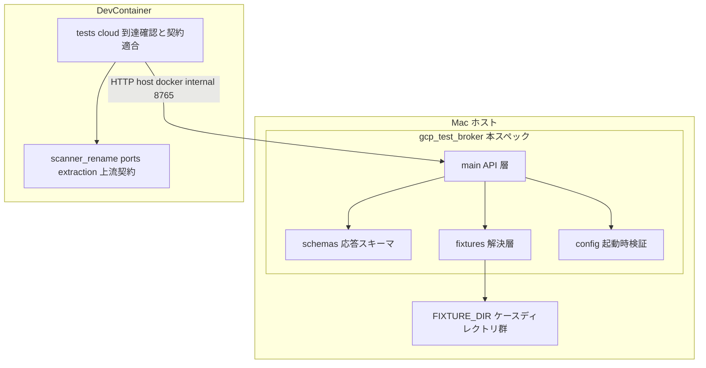
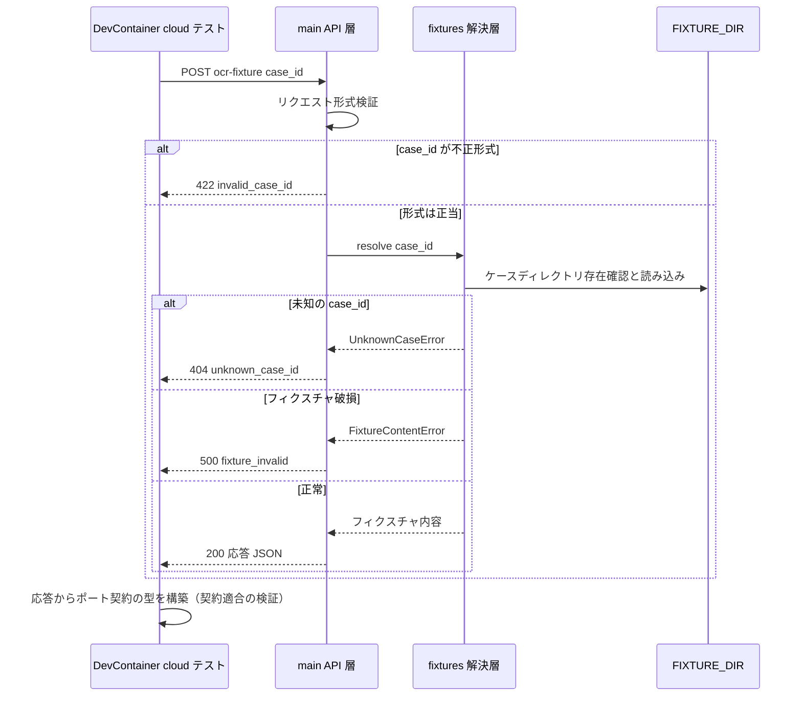

# Design Document: gcp-test-broker

## Overview

**Purpose**: 本機能は、DevContainer 内の Claude Code が生の GCP 認証情報に触れずにクラウド統合テストを実行できるようにするための、Mac ホスト側仲介サービス GCP Test Broker v0 を提供する。v0 は決定論的なテストデータ（OCR フィクスチャ・抽出フィクスチャ）の供給に徹し、`case_id` ベースの狭い API のみを公開する。

**Users**: 開発者（本人）と DevContainer 内の Claude Code が、pytest `cloud` マーカーのテストから Broker を呼び出す。下流スペック cloud-runtime-deploy のクラウド統合テストが本 API の主要な消費者となる。

**Impact**: README のみの `broker/` に独立した uv プロジェクト（パッケージ `gcp_test_broker`）を新設する。リポジトリルートには DevContainer 側の到達確認テスト（`tests/cloud/`）を追加する。アプリ本体（`src/scanner_rename/`）は変更しない。

### Goals

- OCR・抽出フィクスチャを `case_id` で供給する決定論的なエンドポイントを提供する
- `docs/security-notes.md` の隔離モデル（狭い API・非プロキシ・認証情報非漏洩）を実装として成立させる
- DevContainer 内の pytest `cloud` マーカーテストから到達し、応答がポート契約の型に変換可能であることを検証する
- ジョブフロー全体のローカル E2E（cloud-runtime-deploy で実施）の土台となる初期フィクスチャケース一式を提供する

### Non-Goals

- 実 Google API の仲介エンドポイント（Document AI / Gemini / Drive 限定操作）— v1 以降、cloud-runtime-deploy の要求駆動で追加
- アプリ本体の実アダプタ、Broker 応答 → ポート DTO の本番用変換 — cloud-runtime-deploy
- Broker 自体のクラウドデプロイ・常駐化・認証 — Broker はローカル専用の開発基盤
- クラウド統合テストシナリオの定義 — cloud-runtime-deploy が消費者として所有

## Boundary Commitments

### This Spec Owns

- Broker API の形状: エンドポイント・リクエスト/レスポンス JSON スキーマ・エラー応答（本スペックが唯一の所有者。拡張要求は本スペック側を更新する）
- Broker v0 実装一式（`broker/` 配下の独立 uv プロジェクト）と、その単体テスト
- `case_id` によるフィクスチャ解決規則（許可リスト = `FIXTURE_DIR` 直下のケースディレクトリ、`^[a-z0-9_]+$` 制限）
- 初期フィクスチャケース一式（リポジトリ内サンプル `broker/sample_fixtures/` とホスト配置手順）
- DevContainer 側の到達確認・契約適合検証テスト（`tests/cloud/`、pytest `cloud` マーカー）

### Out of Boundary

- ポート契約・抽出スキーマ（`OcrResult` / `DocumentExtraction` / `PortError`）の定義 — extraction-pipeline 所有。本スペックは整合させる側
- Broker 応答をアプリの実行フローに接続するアダプタ — cloud-runtime-deploy
- クラウド統合テストのシナリオ・網羅性 — cloud-runtime-deploy
- gitleaks 等のシークレットスキャン基盤 — secret-scanning（本スペックは「秘密を持たない・出さない」設計で補完する）

### Allowed Dependencies

- Broker 実装（`broker/`）: FastAPI + uvicorn のみをランタイム依存とする。`src/scanner_rename/` を import しない（別ランタイム。スキーマ整合はフィクスチャデータとテストで担保する）
- DevContainer 側 cloud テスト（`tests/cloud/`）: `scanner_rename.ports` / `scanner_rename.extraction`（extraction-pipeline の公開契約）と標準ライブラリ（`urllib.request`）のみ。Broker 以外の外部サービスへ接続しない
- モジュール依存方向（`broker/` 内、左から右のみ import 可）: `config` → `fixtures` → `schemas` → `main`。逆方向は禁止
- Broker v0 は GCP 認証情報・Google API クライアントに依存しない（コードとしても持たない）

### Revalidation Triggers

- Broker API の形状変更（エンドポイント・JSON スキーマ・エラー形式）— cloud-runtime-deploy のクラウド統合テストに影響。消費者と横断レビュー
- extraction-pipeline の `OcrResult` / `DocumentExtraction` 変更 — フィクスチャ JSON スキーマ・サンプル・契約適合テストの追随が必要（上流の Revalidation Triggers と対）
- フィクスチャ格納レイアウト（`FIXTURE_DIR/<case_id>/ocr.json` 等）や `case_id` 規則の変更 — 運用手順と既存フィクスチャ資産に影響
- バインド先・ポート・`GCP_TEST_BROKER_URL` 既定値の変更 — DevContainer 側テストと運用手順に影響
- v1 での実 Google API 仲介の追加 — セキュリティ検証（認証情報非漏洩・許可リスト設計）の再実施が必要

## Architecture

### Architecture Pattern & Boundary Map

小さな階層化 HTTP サービス。設定（起動時検証）→ フィクスチャ解決（許可リスト）→ API 層（入出力検証）の 3 層で、v0 に外部サービス依存はない。



**Architecture Integration**:

- Selected pattern: 単一プロセスの階層化サービス。v0 の規模（フィクスチャ供給のみ）にヘキサゴナル等の抽象は過剰（research.md の Simplification 判断）
- Domain boundaries: Broker API 形状 = 本スペック所有のシーム。ポート契約 = 上流所有のシーム。両者はフィクスチャ JSON の形で接続される
- Steering compliance: セキュリティ境界（ADR 0004・`docs/security-notes.md`）を実装で成立させる。テスト分類は既存 pytest マーカー体系に従う
- Broker は `src/scanner_rename/` を import しない: 別マシン・別プロセスで動く成果物にアプリパッケージを結合させない。スキーマ整合は「サンプルフィクスチャの検証テスト（Broker 側）+ 型構築テスト（DevContainer 側）」の 2 点で担保する

### Technology Stack

| Layer              | Choice / Version                           | Role in Feature                              | Notes                                                  |
| ------------------ | ------------------------------------------ | -------------------------------------------- | ------------------------------------------------------ |
| Broker Runtime     | Python >= 3.13 + uv（独立プロジェクト）    | Mac ホスト上で Broker を実行                 | ルートプロジェクトとは別の `broker/pyproject.toml`     |
| Broker Framework   | FastAPI >= 0.115 + uvicorn >= 0.30         | HTTP API・入出力検証・404 既定応答           | Pydantic による宣言的検証（research.md の採否判断）    |
| Broker Testing     | pytest >= 8 + FastAPI TestClient           | Broker 単体テスト（DevContainer 内で実行可） | httpx（TestClient の依存）を dev 依存に含む            |
| DevContainer Tests | pytest `cloud` マーカー + `urllib.request` | 到達確認・契約適合検証                       | ルートに新規ランタイム依存を追加しない                 |
| Fixture Storage    | ローカルファイルシステム（JSON）           | `FIXTURE_DIR/<case_id>/` にケースを格納      | 既定 `~/scanner-rename-cloud-fixtures`（リポジトリ外） |

## File Structure Plan

### Directory Structure

```text
broker/
├── README.md                    # 更新: 起動手順・FIXTURE_DIR 配置手順・運用上の制約（WHY 中心）
├── pyproject.toml               # 独立 uv プロジェクト（fastapi, uvicorn / dev: pytest, httpx）
├── src/gcp_test_broker/
│   ├── __init__.py
│   ├── config.py                # BrokerConfig（FIXTURE_DIR 解決・起動時検証・ConfigError）
│   ├── fixtures.py              # case_id 検証と FixtureRepository（許可リスト解決・読み込み）
│   ├── schemas.py               # リクエスト/レスポンスの Pydantic モデル（抽出スキーマの鏡写し）
│   └── main.py                  # FastAPI アプリ組み立て・エンドポイント・エラー応答・ログ方針
├── tests/
│   ├── __init__.py
│   ├── conftest.py              # 一時 FIXTURE_DIR とテスト用ケースを組み立てるフィクスチャ
│   ├── test_config.py           # 起動時検証（欠落・非ディレクトリで ConfigError）
│   ├── test_fixtures.py         # 解決規則（正常・未知 case_id・不正形式・壊れた JSON）
│   ├── test_api.py              # エンドポイント契約（health・ocr・extract・404・422・非プロキシ）
│   └── test_sample_fixtures.py  # サンプル全ケースのスキーマ制約と OCR/抽出の整合検証
└── sample_fixtures/             # リポジトリ内サンプル（ホストの FIXTURE_DIR へコピーして使う）
    ├── mortgage_balance_certificate_001/
    │   ├── ocr.json
    │   └── extraction.json
    ├── tax_return_first_page_001/       # 同一レイアウト（以下同）
    ├── medical_expense_notice_001/
    └── low_confidence_title_001/        # 低信頼度（要確認相当）ケース

tests/cloud/                     # ルートプロジェクト側（DevContainer 内で実行）
├── __init__.py
├── conftest.py                  # GCP_TEST_BROKER_URL 解決・到達性プリフライト（不達を明示して失敗）
└── test_broker_fixtures.py      # cloud マーカー: health / OCR → OcrResult / 抽出 → DocumentExtraction
```

### Modified Files

- `broker/README.md` — 候補仕様の記述を確定版（起動手順・フィクスチャ配置・v0 の範囲）に更新
- `tests/README.md` — cloud テストの実行前提（Broker 起動・環境変数）を追記

## System Flows

フィクスチャ要求 1 回のフロー（OCR・抽出とも同型）:



フローレベルの決定事項:

- 形式検証（422）と存在検証（404）を分離し、エラー応答にホスト側パス等の内部情報を含めない（4.2, 4.3）
- 未定義エンドポイントは FastAPI の既定 404 で応答し、いかなる転送・中継も行わない（5.1, 5.2）
- 応答は毎回ファイルから読み込む決定論的な内容で、リクエスト間で状態を持たない（2.3, 3.3）

## Requirements Traceability

| Requirement | Summary                          | Components                                           | Interfaces                                       |
| ----------- | -------------------------------- | ---------------------------------------------------- | ------------------------------------------------ |
| 1.1         | ホスト上・loopback で待ち受け    | main, broker/README                                  | uvicorn 起動（127.0.0.1:8765 既定）              |
| 1.2         | 稼働確認応答                     | main                                                 | `GET /health`                                    |
| 1.3         | 起動時のフィクスチャ格納場所検証 | config                                               | `BrokerConfig.from_env`, `ConfigError`           |
| 1.4         | 起動手順の文書化                 | broker/README                                        | —                                                |
| 2.1–2.3     | OCR フィクスチャ供給             | main, fixtures, schemas                              | `POST /ocr-fixture`, `OcrFixtureResponse`        |
| 3.1–3.4     | 抽出フィクスチャ供給             | main, fixtures, schemas                              | `POST /extract-fixture`, `ExtractionPayload`     |
| 4.1–4.4     | case_id 解決と許可リスト         | fixtures, config                                     | `FixtureRepository`, `CASE_ID_PATTERN`           |
| 5.1–5.5     | セキュリティ境界の維持           | main, broker 全体                                    | 定義済みルートのみ・ログ方針・依存ゼロ（GCP 系） |
| 6.1–6.5     | DevContainer からの到達と検証    | tests/cloud                                          | `GCP_TEST_BROKER_URL`, 契約適合テスト            |
| 7.1–7.4     | 初期フィクスチャケース           | sample_fixtures, test_sample_fixtures, broker/README | ケースレイアウト・整合検証・配置手順             |

## Components and Interfaces

| Component       | Domain/Layer      | Intent                               | Req Coverage                | Key Dependencies              | Contracts    |
| --------------- | ----------------- | ------------------------------------ | --------------------------- | ----------------------------- | ------------ |
| config          | Broker 基盤       | 環境変数の解決と起動時検証           | 1.3                         | なし                          | Service      |
| fixtures        | Broker 基盤       | case_id の許可リスト解決と読み込み   | 2.1, 3.1, 4.1–4.4           | config (P0)                   | Service      |
| schemas         | Broker 契約       | API 入出力の宣言的スキーマ           | 2.2, 3.2                    | Pydantic (P0)                 | State        |
| main            | Broker API        | エンドポイント・エラー応答・ログ方針 | 1.1, 1.2, 2._, 3._, 5.1–5.4 | fixtures (P0), schemas (P0)   | API, Service |
| sample_fixtures | テストデータ      | 初期ケース一式（E2E の土台）         | 3.4, 7.1–7.4                | 上流抽出スキーマとの整合 (P1) | —            |
| tests/cloud     | DevContainer 検証 | 到達確認と契約適合の cloud テスト    | 6.1–6.5                     | scanner_rename 契約 (P0)      | —            |
| broker/README   | 運用文書          | 起動・配置手順と制約の文書化         | 1.1, 1.4, 4.4, 7.4          | —                             | —            |

### Broker 基盤レイヤ

#### config

| Field        | Detail                                         |
| ------------ | ---------------------------------------------- |
| Intent       | 環境変数からの設定解決と、起動を止める早期検証 |
| Requirements | 1.3                                            |

**Responsibilities & Constraints**

- `FIXTURE_DIR`（既定 `~/scanner-rename-cloud-fixtures`、`~` 展開あり）を解決する。存在しない・ディレクトリでない・読み取れない場合は `ConfigError` を送出し、プロセスを起動させない（fail fast、1.3）
- v0 の設定は `FIXTURE_DIR` のみ。GCP 関連の設定項目を持たない（5.5 の構造的保証の一部）

##### Service Interface

```python
class ConfigError(Exception): ...   # メッセージに原因と対象パスを含める（起動ログにのみ現れる）

@dataclass(frozen=True)
class BrokerConfig:
    fixture_dir: Path

def load_config(env: Mapping[str, str]) -> BrokerConfig: ...
```

- Postconditions: 戻り値の `fixture_dir` は存在する読み取り可能なディレクトリ
- Invariants: 検証失敗は必ず `ConfigError`（曖昧な既定値でのフォールバックをしない）

#### fixtures

| Field        | Detail                                                       |
| ------------ | ------------------------------------------------------------ |
| Intent       | `case_id` を許可リスト化されたフィクスチャに解決し内容を返す |
| Requirements | 2.1, 3.1, 4.1, 4.2, 4.3, 4.4                                 |

**Responsibilities & Constraints**

- `case_id` は `^[a-z0-9_]+$`（1〜64 文字）に一致しなければ `InvalidCaseIdError`。パス区切り・親参照・隠しファイル参照は構造的に不可能（4.3）
- 許可リストの実体は `FIXTURE_DIR` 直下のディレクトリ集合（research.md の決定）。パターン適合かつディレクトリ存在で解決成功、それ以外は `UnknownCaseError`（4.1, 4.2）
- ケースレイアウト: `FIXTURE_DIR/<case_id>/ocr.json`（`{"text": str}`）と `extraction.json`（抽出ペイロード）。該当ファイル欠落・JSON 破損・スキーマ不適合は `FixtureContentError`（運用者が直すべき状態を 500 系として区別する）
- 読み込みは要求のたびに行い、プロセス内キャッシュを持たない（フィクスチャ編集が即時反映される。決定論は「同一ファイル内容 → 同一応答」で担保）
- エラーメッセージ・応答にホスト側の絶対パスを含めない（内部情報の非漏洩、4.2）。詳細パスは Broker 側ログにのみ出す

##### Service Interface

```python
CASE_ID_PATTERN: re.Pattern[str]    # ^[a-z0-9_]{1,64}$

class FixtureError(Exception): ...
class InvalidCaseIdError(FixtureError): ...
class UnknownCaseError(FixtureError): ...
class FixtureContentError(FixtureError): ...

class FixtureRepository:
    def __init__(self, fixture_dir: Path) -> None: ...
    def load_ocr(self, case_id: str) -> OcrFixture: ...          # schemas の型で返す
    def load_extraction(self, case_id: str) -> ExtractionPayload: ...
```

- Preconditions: `fixture_dir` は検証済み（config の事後条件）
- Postconditions: 戻り値は schemas の検証を通過済み（スキーマ不適合はここで `FixtureContentError` に変換）
- Invariants: `fixture_dir` の外のパスに一切アクセスしない

### Broker 契約レイヤ

#### schemas

| Field        | Detail                                                   |
| ------------ | -------------------------------------------------------- |
| Intent       | API 入出力の Pydantic モデル（上流抽出スキーマの鏡写し） |
| Requirements | 2.2, 3.2                                                 |

**Responsibilities & Constraints**

- 抽出ペイロードは extraction-pipeline の `DocumentExtraction` とフィールド 1:1 対応（`document_date` / `title` / `issuer` / `document_type` / `period` / `reason`。欠落は `null`、日付は ISO 8601 文字列 `YYYY-MM-DD`、期間種別は `calendar_year` / `fiscal_year` / `explicit_range`）
- 上流の不変条件のうち機械検証可能なもの（信頼度 0.0–1.0、期間種別ごとの必須フィールド）を Pydantic バリデータで再現する（3.2。Broker 側で壊れたフィクスチャを配信前に検出する）
- このモデルはあくまで「鏡写し」であり、契約の正本は extraction-pipeline の `extraction/schema.py`。乖離時は上流に従い本モジュールを追随させる（Revalidation Triggers）

##### Service Interface

```python
class FixtureRequest(BaseModel):
    case_id: str                     # パターン検証は fixtures 層と二重にせず、ここで pattern 制約を宣言

class OcrFixture(BaseModel):
    text: str                        # OcrResult.text に対応（空文字列は正常値）

class OcrFixtureResponse(BaseModel):
    case_id: str
    ocr: OcrFixture

class ExtractedDatePayload(BaseModel):
    value: date
    source_uses_japanese_era: bool
    japanese_era: str | None
    evidence: str
    confidence: float                # 0.0 <= x <= 1.0

class ExtractedTextPayload(BaseModel):
    value: str
    evidence: str
    confidence: float

class ExtractedPeriodPayload(BaseModel):
    kind: Literal["calendar_year", "fiscal_year", "explicit_range"]
    year: int | None
    start_year_month: str | None     # "YYYYMM"
    end_year_month: str | None
    evidence: str
    confidence: float                # 種別ごとの必須フィールドはバリデータで検証

class ExtractionPayload(BaseModel):
    document_date: ExtractedDatePayload | None
    title: ExtractedTextPayload | None
    issuer: ExtractedTextPayload | None
    document_type: ExtractedTextPayload | None
    period: ExtractedPeriodPayload | None
    reason: str

class ExtractionFixtureResponse(BaseModel):
    case_id: str
    extraction: ExtractionPayload

class ErrorResponse(BaseModel):
    error: str                       # "invalid_case_id" | "unknown_case_id" | "fixture_invalid"
    detail: str                      # 内部パスを含まない短い説明
```

- Invariants: レスポンスモデルに認証情報・ヘッダー・内部パスを表現するフィールドが存在しない（型レベルで 5.3 を支える）

### Broker API レイヤ

#### main

| Field        | Detail                                                         |
| ------------ | -------------------------------------------------------------- |
| Intent       | FastAPI アプリの組み立て・エンドポイント定義・エラー応答・ログ |
| Requirements | 1.1, 1.2, 2.1, 2.3, 3.1, 3.3, 5.1, 5.2, 5.3, 5.4               |

**Responsibilities & Constraints**

- 公開エンドポイントは下表の 3 つのみ。それ以外のパスは FastAPI 既定の 404（転送・中継なし、5.1, 5.2）。プロキシ的な汎用エンドポイントを追加しないことが本スペックの恒久制約
- 起動時に `load_config` を実行し、`ConfigError` はプロセス終了（1.3）。アプリ生成は `create_app(config)` のファクトリ関数とし、テストから一時ディレクトリで構築可能にする
- ログ方針: アクセスログはメソッド・パス・ステータス・`case_id` のみ。リクエストヘッダー・環境変数・認証情報様の値をログに書かない（5.4）。uvicorn の既定アクセスログはこの方針の範囲内（ヘッダーを含まない）
- 待ち受けは uvicorn 起動引数で `127.0.0.1:8765` を既定とする（1.1）。バインド先をコードに埋め込まず、README の起動手順で指定する

##### API Contract

| Method | Endpoint         | Request          | Response (200)              | Errors                                                        |
| ------ | ---------------- | ---------------- | --------------------------- | ------------------------------------------------------------- |
| GET    | /health          | —                | `{"status": "ok"}`          | —                                                             |
| POST   | /ocr-fixture     | `FixtureRequest` | `OcrFixtureResponse`        | 422 invalid_case_id, 404 unknown_case_id, 500 fixture_invalid |
| POST   | /extract-fixture | `FixtureRequest` | `ExtractionFixtureResponse` | 422 invalid_case_id, 404 unknown_case_id, 500 fixture_invalid |

- エラーボディは `ErrorResponse` に統一。404/422/500 の使い分けは System Flows の決定事項に従う
- 同一 `case_id` への応答はフィクスチャファイル内容のみで決まる（2.3, 3.3）

**Implementation Notes**

- Integration: `uv run uvicorn gcp_test_broker.main:app --host 127.0.0.1 --port 8765`（README に確定記載）。`app` はモジュールレベルで `create_app(load_config(os.environ))` により生成
- Validation: broker/tests の TestClient で全エンドポイント・全エラー分岐を検証。未定義パス（例: `/proxy`, `/raw-google-api`）が 404 になることを明示的にテスト（5.1, 5.2）
- Risks: uvicorn / FastAPI のバージョン差異でエラー応答形式が変わる可能性 → エラーボディを自前の `ErrorResponse` で統一し、既定のエラー形式に依存しない

### テストデータとドキュメント

#### sample_fixtures（初期フィクスチャケース）

| Field        | Detail                                        |
| ------------ | --------------------------------------------- |
| Intent       | ローカル E2E の土台となる配布用初期ケース一式 |
| Requirements | 3.4, 7.1, 7.2, 7.3, 7.4                       |

**Responsibilities & Constraints**

- 4 ケースを提供する:
  - `mortgage_balance_certificate_001` — 住宅ローン残高証明書（元号日付・発行元あり。期待名: `20211001(R3)_住宅取得資金に係る借入金の年末残高等証明書_三井住友銀行.pdf` 相当の抽出内容）
  - `tax_return_first_page_001` — 確定申告書第一表（年分期間付き）
  - `medical_expense_notice_001` — 医療費通知（年度分期間付き）
  - `low_confidence_title_001` — タイトル信頼度が既定閾値 0.7 未満（要確認相当、3.4, 7.2）
- 各ケースの `ocr.json` は抽出結果の全エビデンス文字列を含むテキストを持つ（同一文書としての整合、7.3）
- 高信頼度 3 ケースの抽出内容は extraction-pipeline の合意済み 3 例と同じ文書を表し、命名エンジンを通せば合意済み最終名に到達しうる値とする（E2E の土台、7.1）
- リポジトリ内は配布原本であり、Broker はホスト側 `FIXTURE_DIR` のコピーから配信する（4.4, 7.4）。コピー手順（`cp -R` 一発）を README に記す

**Implementation Notes**

- Validation: `broker/tests/test_sample_fixtures.py` がサンプル全ケースについて (a) `FixtureRepository` で読めること、(b) スキーマ制約を満たすこと、(c) エビデンスが OCR テキストに含まれることを検証する（7.3 の機械検証）
- Risks: 上流スキーマ変更でサンプルが陳腐化 → 本テストが Broker 側の早期検出網になる

#### tests/cloud（DevContainer 側到達確認・契約適合テスト）

| Field        | Detail                                                      |
| ------------ | ----------------------------------------------------------- |
| Intent       | DevContainer から Broker へ到達し、応答の契約適合を検証する |
| Requirements | 6.1, 6.2, 6.3, 6.4, 6.5                                     |

**Responsibilities & Constraints**

- すべて `@pytest.mark.cloud`。ルート `pyproject.toml` の既定 `addopts`（`-m 'not cloud and not e2e_cloud'`）によりデフォルト実行から除外される（6.2）。実行は `uv run pytest -m cloud tests/cloud` を README に記載
- 接続先は環境変数 `GCP_TEST_BROKER_URL`（既定 `http://host.docker.internal:8765`）。HTTP クライアントは標準ライブラリ `urllib.request`（ルートに依存を足さない）
- conftest のセッションフィクスチャが `/health` へのプリフライトを行い、接続不能時は「Broker が起動していないか到達できない（起動手順は broker/README）」を明示するメッセージで `pytest.fail` する（6.4）
- 契約適合検証（6.3）: OCR 応答 → `OcrResult(text=...)` を構築、抽出応答 → テストローカルヘルパで `DocumentExtraction`（および構成型）を構築し、frozen dataclass の `__post_init__` 不変条件を通す。ヘルパは `tests/cloud/` 内に閉じ、`src/` に変換モジュールを作らない（境界決定、research.md）
- 検証対象ケースはサンプル 4 ケース + 未知 `case_id` の 404 応答。Broker 以外への接続を行わない（6.5。Google API のホスト名はコード中に現れない）

## Data Models

### Data Contracts & Integration

- フィクスチャファイル契約（運用者 ↔ Broker）: `FIXTURE_DIR/<case_id>/ocr.json` は `{"text": str}`、`extraction.json` は `ExtractionPayload` と同形の JSON。サンプル一式が正とする実例
- API 契約（Broker ↔ DevContainer テスト）: 上記 API Contract 表と schemas のモデル定義が正。JSON のみ（他のシリアライゼーションを持たない）
- 上流契約との対応: `OcrFixture.text` → `OcrResult.text`、`ExtractionPayload` → `DocumentExtraction`（フィールド 1:1、`value` の日付のみ ISO 文字列 → `date` の変換が必要）。この対応表が崩れる変更は Revalidation Trigger
- 永続状態なし: Broker はステートレスで、フィクスチャファイル以外の読み書きを行わない

## Error Handling

### Error Strategy

「呼び出し側の誤り（4xx）」と「フィクスチャ資産の破損（500）」を区別し、いずれも内部情報（ホストパス・スタックトレース）を応答に含めない。起動時の設定不備は fail fast でプロセスを起動させない。

### Error Categories and Responses

- 形式不正の `case_id`（422 `invalid_case_id`）: パターン不一致。解決を試みない（4.3）
- 未知の `case_id`（404 `unknown_case_id`）: 許可リストに存在しない。存在するケース一覧は返さない（4.2）
- フィクスチャ破損（500 `fixture_invalid`）: ファイル欠落・JSON 不正・スキーマ不適合。応答にはケース ID と種別のみ、詳細パスは Broker ログへ（運用者が直す）
- 未定義エンドポイント（404）: FastAPI 既定応答。転送しない（5.2）
- 起動時設定不備（`ConfigError`）: 起動失敗。原因パスを標準エラーに出力（1.3）

### Monitoring

ローカル開発ツールのため本格的な監視は持たない。uvicorn のアクセスログ（メソッド・パス・ステータス）と、フィクスチャ破損時の警告ログのみ。ログにヘッダー・環境変数・認証情報様の値を出さない方針は main の節に定義（5.4）。

## Testing Strategy

### Broker Unit Tests（`broker/tests`、DevContainer 内で実行可能）

- config: `FIXTURE_DIR` 未存在・ファイル指定・未設定時の既定値解決、`ConfigError` の発生（1.3）
- fixtures: 正常解決（ocr / extraction）、未知 `case_id` → `UnknownCaseError`、`../evil` や `a/b` 等の不正形式 → `InvalidCaseIdError`、JSON 破損・スキーマ不適合 → `FixtureContentError`（4.1–4.3）
- schemas: 信頼度範囲外・期間種別の必須フィールド欠落が検証エラーになること、欠落フィールド null の正常受理（3.2）
- api（TestClient）: `/health` 200（1.2）、`/ocr-fixture` / `/extract-fixture` の 200 応答形状と同一 `case_id` の再現性（2.1–2.3, 3.1, 3.3）、404/422/500 のエラーボディ統一、未定義パス（`/proxy` 等）の 404（5.1, 5.2）、応答全体に Authorization / トークン様文字列が含まれないこと（5.3）
- sample_fixtures: 全 4 ケースの読み込み成功・スキーマ適合・エビデンスと OCR テキストの整合・低信頼度ケースの閾値未満確認（3.4, 7.1–7.3）

### Cloud Integration Tests（`tests/cloud`、pytest `cloud` マーカー、要 Broker 起動）

- 到達確認: `/health` プリフライト成功、デフォルト実行（マーカー除外）で本テストが収集されないこと（6.1, 6.2）
- 契約適合: サンプル各ケースの OCR 応答 → `OcrResult` 構築、抽出応答 → `DocumentExtraction` 構築（不変条件通過）、低信頼度ケースの信頼度値の確認（6.3）
- 異常系: 未知 `case_id` で 404 とエラーボディ形式の確認（6.1）
- 不達時の挙動: Broker 停止状態で実行した場合に到達不能を明示するメッセージで失敗すること（6.4。手動確認手順として README に記載し、テスト自体はプリフライト実装で担保）

### 手動確認（README 記載の運用手順）

- Mac ホストでの起動 → DevContainer からの `cloud` テスト一式のグリーン確認（本スペックの完了条件、6.1）
- サンプルフィクスチャのホスト配置手順の実施確認（7.4）

## Security Considerations

- 隔離モデルの実装: DevContainer 側テストは Broker のみと通信し、Google API ホストへの接続コードを持たない（6.5）。Broker v0 は GCP 認証情報・Google API クライアントをコードとして持たない（5.5）
- 非プロキシ保証: 公開ルートは 3 つに固定。汎用転送・任意リクエスト実行のエンドポイントを追加しないことが恒久制約（5.1, 5.2）
- 情報漏洩面: 応答スキーマに秘密を表現するフィールドがなく（型レベル保証）、ログはメソッド・パス・ステータス・case_id に限定（5.3, 5.4）。エラー応答にホスト側パスを含めない（4.2）
- ファイルアクセス面: `case_id` パターン制限 + `FIXTURE_DIR` 配下限定で、任意ホストファイルの読み出し経路を作らない（4.1, 4.3）
- 待ち受け面: 既定 127.0.0.1 バインドで LAN に露出しない（1.1）
